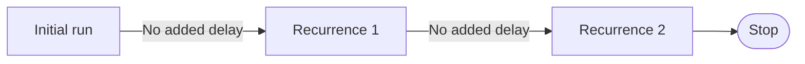
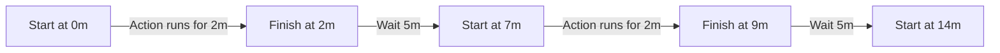
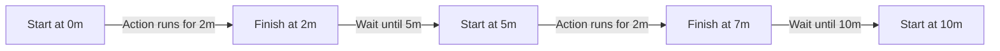
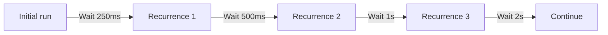
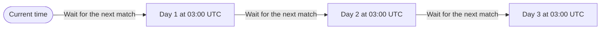

Start with the schedule that defines when the next recurrence can happen. Add a
function that limits or adjusts that schedule when one timing rule is enough.
Combine schedules when multiple timing rules must work together or run in
sequence.

This page assumes you already know whether the action should use
[`Effect.repeat`, `Effect.schedule`, or
`Effect.retry`](/docs/v4/scheduling/using-schedules).

## Choose a starting rule

Choose the constructor from the timing requirement:

| Requirement                 | Constructor                          | Behavior                                                 |
| --------------------------- | ------------------------------------ | -------------------------------------------------------- |
| Limit immediate recurrences | `Schedule.recurs(2)`                 | Allows at most two recurrences without adding a delay    |
| Wait after each action      | `Schedule.spaced("5 minutes")`       | Starts the full delay after the previous action finishes |
| Follow a regular cadence    | `Schedule.fixed("5 minutes")`        | Keeps starts aligned to five-minute intervals            |
| Increase the delay          | `Schedule.exponential("250 millis")` | Increases the delay after each recurrence                |
| Run at calendar times       | `Schedule.cron("0 3 * * *", "UTC")`  | Uses a cron expression and time zone                     |

See [Scheduling work with cron](/docs/v4/scheduling/cron) for cron expressions,
time zones, and validation.

## How the starting rules advance

The diagrams below show the recurrences that each schedule permits after an
initial action has run.

### `Schedule.recurs`

`Schedule.recurs(2)` permits two more runs without adding a delay.



### `Schedule.spaced`

`Schedule.spaced("5 minutes")` starts the full delay when the previous action
finishes. If each action takes two minutes, starts are seven minutes apart.



### `Schedule.fixed`

`Schedule.fixed("5 minutes")` keeps starts aligned to five-minute intervals.
The same two-minute action starts at 0, 5, and 10 minutes.



If an action takes longer than the interval, the next recurrence happens
immediately. `Schedule.fixed` does not replay the intervals that were missed.

### `Schedule.exponential`

With the default factor of two, `Schedule.exponential("250 millis")` doubles
the delay after every recurrence.



### `Schedule.cron`

`Schedule.cron("0 3 * * *", "UTC")` permits a recurrence at 03:00 UTC each
day.



## Limit or adjust one schedule

Several functions take an existing schedule and return a new one with an added
rule:

| Requirement                       | Function               | Result                                       |
| --------------------------------- | ---------------------- | -------------------------------------------- |
| Limit recurrences or elapsed time | `Schedule.upTo`        | Stops the schedule when a limit is reached   |
| Stop from schedule metadata       | `Schedule.while`       | Continues only while a condition holds       |
| Change the selected delay         | `Schedule.modifyDelay` | Replaces the delay for each recurrence       |
| Randomize delays                  | `Schedule.jittered`    | Adds jitter to reduce synchronized retries   |
| Observe schedule decisions        | `Schedule.tap`         | Runs an Effect without changing the schedule |

Use these functions when one schedule already provides the timing rule you
need.

**Example** (Limiting an Exponential Backoff)

`Schedule.upTo` can limit an exponential backoff by number of recurrences,
elapsed duration, or both:

```ts twoslash import.meta.vitest name="choosing-schedules-add-direct-limits"
import { Schedule } from "effect"

const boundedBackoff = Schedule.exponential("250 millis").pipe(
  Schedule.upTo({ times: 5, duration: "30 seconds" }),
)
```

The schedule stops as soon as either limit is reached. `times: 5` allows five
schedule recurrences. With `Effect.repeat` or `Effect.retry`, the action also
runs once before the schedule is stepped.

Combine schedules only when the requirement depends on timing rules from
separate schedules.

## Require every rule with `Schedule.max`

`Schedule.max` continues only while every schedule can recur. For each
recurrence, it uses the largest delay selected by the schedules.

**Example** (Combining Backoff with Minimum Spacing)

Suppose an exponential backoff controls how retry delays grow, while an API
client requires at least one second between requests. `Schedule.max` applies
both rules by selecting the larger delay. `Schedule.upTo` adds the retry limit
separately.

```ts twoslash import.meta.vitest name="choosing-schedules-require-every-rule"
import { Schedule } from "effect"

const backoff = Schedule.exponential("250 millis")
const minimumSpacing = Schedule.spaced("1 second")

const retryPolicy = Schedule.max([backoff, minimumSpacing]).pipe(
  Schedule.upTo({ times: 5 }),
)
```

For each recurrence, both schedules propose a delay and `Schedule.max` selects
the larger one:

| Recurrence | Exponential backoff | Minimum spacing | Delay selected by `max` |
| ---------: | ------------------: | --------------: | ----------------------: |
|          1 |              250 ms |             1 s |                 **1 s** |
|          2 |              500 ms |             1 s |                 **1 s** |
|          3 |                 1 s |             1 s |                 **1 s** |
|          4 |                 2 s |             1 s |                 **2 s** |
|          5 |                 4 s |             1 s |                 **4 s** |

The minimum spacing determines the first three delays. Starting with the fourth
recurrence, the exponential backoff is larger.

## Allow any rule with `Schedule.min`

`Schedule.min` continues while at least one schedule can recur. It uses the
smallest delay among the schedules that are still active.

**Example** (Adding Faster Startup Probes)

Suppose an application needs two quick startup probes while its regular health
checks stay aligned to a ten-second cadence. Both schedules start together.
`Schedule.min` lets the startup policy select the shorter delays while it is
active.

```ts twoslash import.meta.vitest name="choosing-schedules-allow-any-rule"
import { Schedule } from "effect"

const startupProbes = Schedule.spaced("1 second").pipe(
  Schedule.upTo({ times: 2 }),
)
const healthChecks = Schedule.fixed("10 seconds")

const combinedChecks = Schedule.min([startupProbes, healthChecks])
```

For each recurrence, `Schedule.min` selects the shortest delay proposed by an
active schedule:

| Recurrence | Elapsed time | Startup probes | Health-check cadence | Delay selected by `min` |
| ---------: | -----------: | -------------: | -------------------: | ----------------------: |
|          1 |          0 s |            1 s |                 10 s |                 **1 s** |
|          2 |          1 s |            1 s |                  9 s |                 **1 s** |
|          3 |          2 s |       Complete |                  8 s |                 **8 s** |
|          4 |         10 s |       Complete |                 10 s |                **10 s** |

The startup policy controls the first two delays. After it completes, the
health-check schedule continues on its original ten-second cadence.
`Schedule.min` stops only when every input schedule has completed.

## Run rules in phases with `Schedule.concat`

Use `Schedule.concat` when one schedule must finish before another starts.

**Example** (Reconnecting in Two Stages)

This reconnect policy tries three short waits, then switches to as many as ten
long waits:

```ts twoslash import.meta.vitest name="choosing-schedules-run-rules-in-phases"
import { Schedule } from "effect"

const quickRetries = Schedule.spaced("100 millis").pipe(
  Schedule.upTo({ times: 3 }),
)

const slowRetries = Schedule.spaced("5 seconds").pipe(
  Schedule.upTo({ times: 10 }),
)

const reconnect = quickRetries.pipe(Schedule.concat(slowRetries))
```

`concat` merges the output types of both phases. Use
`Schedule.concatResult` when later code must distinguish which phase produced
an output.

See [Retry quickly, then slow down](/docs/v4/scheduling/cookbook#retry-quickly-then-slow-down)
for a complete retrying program. The
[Schedule cookbook](/docs/v4/scheduling/cookbook) also covers server-provided
delays, hard deadlines, and retry observability. The
[`Schedule` API reference](/docs/v4/api/effect/Schedule) lists every
available function.
