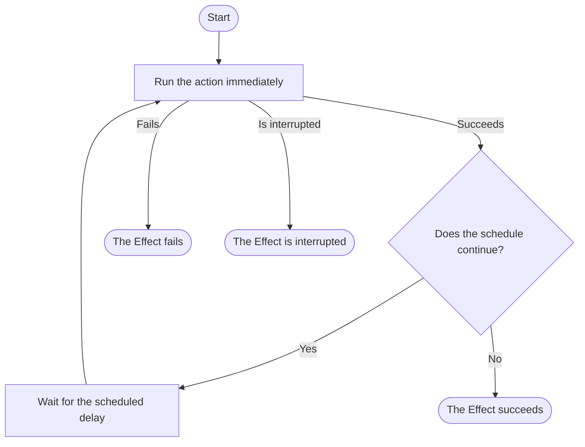
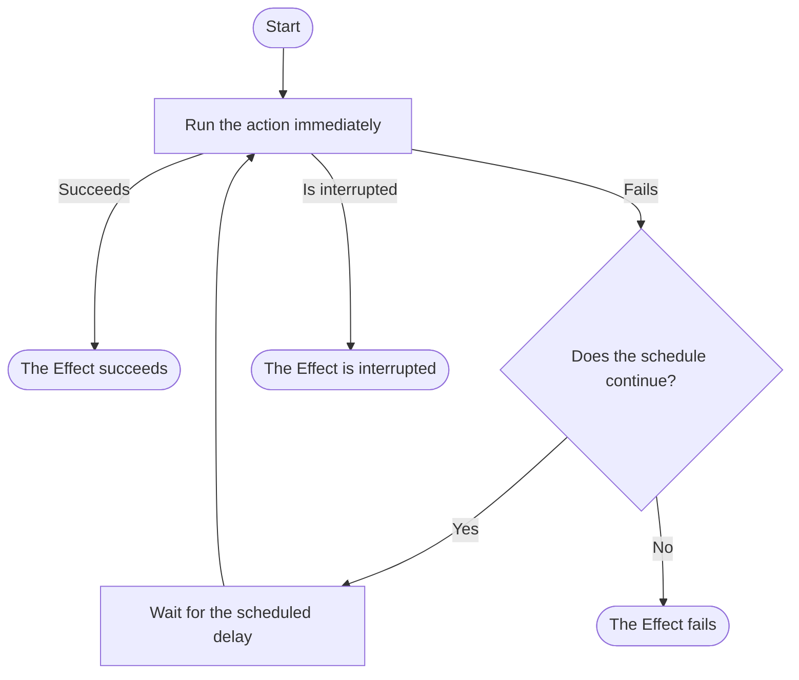

A `Schedule` controls when an Effect may run again and when repetition stops.
Choose the function that matches what triggers the next run:

- Use `Effect.repeat` after a successful run.
- Use `Effect.schedule` when the first run must also wait for the schedule.
- Use `Effect.retry` after a failure.

These functions schedule work only while the current Effect runtime is running.
They do not persist jobs or recover runs missed during downtime.

The function determines what triggers another run. The schedule determines when
that run may start and when repetition stops. See
[Choosing and combining schedules](/docs/v4/scheduling/choosing-and-combining-schedules)
to select those rules.

## Repeat after success

`Effect.repeat` schedules another run only after the action succeeds. A failure
or interruption stops repetition and is propagated by the resulting Effect.
The action runs once before the schedule starts, so the schedule controls only
the additional runs.



**Example** (Polling a Background Job)

An application checks the status of a background job every 100 milliseconds.

```ts twoslash
import { Effect, Schedule } from "effect"

const checkJobStatus = Effect.logInfo("Checking job status")

const pollingInterval = Schedule.spaced("100 millis")

const jobStatusPolling = checkJobStatus.pipe(Effect.repeat(pollingInterval))
```

`Effect.repeat` runs `checkJobStatus` immediately. After each successful run,
`pollingInterval` waits 100 milliseconds before allowing the next one.
`Schedule.spaced` does not stop on its own, so the effect continues until it
fails or is interrupted.

### Stop when a result is ready

You can stop repetition based on the action's result with `until` or `while`,
and limit the number of repetitions with `times`. Pass these options directly
to `Effect.repeat`. This example stops when the job completes, with a limit of
ten checks.

**Example** (Waiting for the Job to Complete)

```ts twoslash import.meta.vitest name="using-schedules-stop-when-ready"
import { Effect, Schedule } from "effect"

// Simulate a job that completes on the third status check
let checks = 0

const checkJobStatus = Effect.sync(() => {
  checks++
  return checks < 3 ? "pending" : "complete"
})

const status = await Effect.runPromise(
  checkJobStatus.pipe(
    Effect.repeat({
      schedule: Schedule.spaced("100 millis"),
      until: (status) => status === "complete",
      times: 9,
    }),
  ),
)

status // => "complete"
checks // => 3
```

`times: 9` allows nine checks after the first one, for at most ten checks. If the
job has not completed by then, `Effect.repeat` returns the latest status.

## Wait before the first run

`Effect.repeat` runs the action immediately. Use `Effect.schedule` instead when
the first run must wait for the first scheduled time.

**Example** (Removing Expired Local Cache Files)

An application removes expired files from its local cache once per hour. It
waits for the first hour to pass instead of doing disk work during startup.

```ts twoslash
import { Effect, Schedule } from "effect"

const removeExpiredCacheFiles = Effect.logInfo(
  "Removing expired local cache files",
)

const cleanupInterval = Schedule.spaced("1 hour")

const cacheCleanup = Effect.schedule(removeExpiredCacheFiles, cleanupInterval)
```

`cacheCleanup` waits one hour before its first run, then waits another hour after
each successful cleanup before running again.

## Retry after failure

Use `Effect.retry` when another run should happen after a failure instead of a
successful result. The first attempt runs immediately, and the schedule controls
the retries that follow.



**Example** (Retrying a Temporary Failure)

```ts twoslash import.meta.vitest name="using-schedules-retry-after-failure"
import { Effect, Schedule } from "effect"

// Simulate a request that succeeds on the third attempt
let attempts = 0
const request = Effect.suspend(() => {
  attempts++
  return attempts < 3 ? Effect.fail("temporary") : Effect.succeed("ok")
})

const result = Effect.runSync(request.pipe(Effect.retry(Schedule.recurs(2))))

result // => "ok"
attempts // => 3
```

`Schedule.recurs(2)` permits two retries after the initial attempt, for at most
three attempts in total.

See [Retrying](/docs/v4/error-management/retrying) for retry conditions and
fallbacks. [Schedule cookbook](/docs/v4/scheduling/cookbook) shows how to
follow `Retry-After`, reconnect in stages, and record scheduled retries.

## Handle failures during repetition

`Effect.repeat` and `Effect.schedule` stop at the first failure. If an expected
failure should not stop later runs, handle it inside the repeated action. Do not
hide permanent errors only to keep the loop running.

Use `Effect.repeatOrElse` when the loop should stop but a fallback needs the
failure and the latest schedule metadata, when available. See the
[`Effect` API reference](/docs/v4/api/effect/Effect) for its full signature and
the other repetition options.

Next, choose a starting rule and add only the limits or changes it needs in
[Choosing and combining schedules](/docs/v4/scheduling/choosing-and-combining-schedules).
