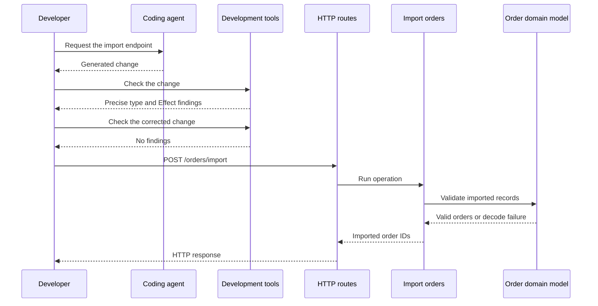

import {
  TutorialCheckpoint,
  TutorialPainPoint,
} from "@astrojs/starlight/components"

<TutorialPainPoint title="LLMs produce plausible-looking slop">
  LLMs can produce code that looks correct and passes the happy path while
  hiding failures, trusting unvalidated data, or adding logging and validation
  work that never runs.

With Effect, precise types make many of these mistakes harder to express.
Effect-aware developer tools then detect suspicious code that still gets
through.

</TutorialPainPoint>

## What you will build

The example is a coding agent adding `POST /orders/import` to a familiar
`node:http` server. The first implementation works for the supplied file, but
the development checks report three diagnostics: messages that identify
concrete mistakes. The same evidence then defines one focused correction before
the endpoint is verified again.

The finished backend has these observable results:

| Evidence                        | Generated change                  | Corrected change                         |
| ------------------------------- | --------------------------------- | ---------------------------------------- |
| `POST /orders/import`           | `200` with two imported order ids | The same `200` response                  |
| Import log                      | Missing                           | `Importing orders` appears               |
| Effect-aware development checks | Three known findings              | No findings                              |
| File and decoding failure types | Declared error type is `never`    | Both failures remain visible in the type |

The HTTP server remains ordinary TypeScript. Only the order import uses Effect,
so the diagnostic and correction loop remains easy to inspect.

## Where this tutorial fits

The table identifies the parts of the shared order-processing system covered by this tutorial. See the [complete architecture](/docs/v4/tutorials/introduction#architecture) for the full system.

| Part               | Area                  | Role in this tutorial                                             |
| ------------------ | --------------------- | ----------------------------------------------------------------- |
| HTTP routes        | HTTP boundary         | Run Import orders only after the development checks pass          |
| Import orders      | Application operation | Expose structural mistakes through precise types                  |
| Order domain model | Shared contract       | Validate imported records                                         |
| Development tools  | Development time      | Report TypeScript and Effect mistakes before the application runs |

### Development and request flow



## Project setup

The project uses five files:

| File             | Role                                                                |
| ---------------- | ------------------------------------------------------------------- |
| `server.ts`      | Contains the endpoint generated and then corrected in the tutorial. |
| `orders.json`    | Fixed input that supplies predictable external order data.          |
| `package.json`   | Records the diagnostic tools and commands.                          |
| `tsconfig.json`  | Enables strict type checking with TypeScript 7.                     |
| `.oxlintrc.json` | Configures the Effect-aware diagnostics.                            |

The TypeScript configuration enables the strict checks expected by Effect:

```json title="tsconfig.json"
{
  "compilerOptions": {
    "strict": true
  }
}
```

The controlled order-import data lives in `orders.json`:

```json title="orders.json" ins={1}
[{ "externalOrderId": "external-1001" }, { "externalOrderId": "external-1002" }]
```

Run the server with `--watch`. This option reloads `server.ts` after each saved
edit, so the same process can remain running throughout the tutorial:

```sh title="Watched server"
node --watch server.ts
```

## The solution, step by step

### 1. Start from a familiar TypeScript server

The initial `server.ts` has only a health endpoint, so there is no Effect code
to understand yet.

```ts title="server.ts" ins={1-23}
import { createServer } from "node:http"

const sendJson = (
  response: import("node:http").ServerResponse,
  status: number,
  body: unknown,
): void => {
  response.writeHead(status, { "content-type": "application/json" })
  response.end(JSON.stringify(body))
}

const server = createServer((request, response) => {
  if (request.method === "GET" && request.url === "/health") {
    sendJson(response, 200, { status: "ready" })
    return
  }

  sendJson(response, 404, { error: "NotFound" })
})

server.listen(3000, () => {
  console.log("Listening on http://localhost:3000")
})
```

In a second terminal pane, this request checks the starter:

```sh title="Health endpoint request"
curl -i -sS http://localhost:3000/health
```

The response is:

```text title="Expected response"
HTTP/1.1 200 OK
...

{"status":"ready"}
```

<TutorialCheckpoint number={1} total={4} title="The starter server is healthy">
  The watched server is running, and `GET /health` returns `200` with
  `{"status":"ready"}`.
</TutorialCheckpoint>

### 2. Add only the diagnostics this review needs

The backend change will use Effect, and the review needs Effect's type-aware
rules from the command line. These commands install the compatible Oxlint
tooling:

```sh title="Static diagnostics"
npm install --save-dev typescript@latest @types/node@22 @effect/tsgo oxlint oxlint-tsgolint
npx effect-tsgo patch --oxlint
npm pkg set scripts.prepare="effect-tsgo patch --oxlint"
npm pkg set scripts.lint="oxlint ."
```

The local `effect-tsgo` binary patches the compatible local Oxlint binary so
Oxlint can run Effect's type-aware rules. The `prepare` script repeats that
patch after later installs. This tutorial needs command-line evidence only, so
there is no editor-specific setup. The complete development-tool options are in
[Installation and Dev Tools](/docs/v4/get-started/installation).

The recommended Oxlint configuration is:

```json title=".oxlintrc.json" ins={1-4}
{
  "$schema": "./node_modules/@effect/tsgo/oxlint-schema.json",
  "extends": ["./node_modules/@effect/tsgo/oxlint-presets/recommended.json"]
}
```

This command checks the unchanged starter:

```sh title="Clean diagnostic baseline"
npm run lint
```

The command exits successfully with no findings. That clean baseline matters:
the findings in the next step will belong to the new endpoint, not to unfinished
setup.

<TutorialCheckpoint
  number={2}
  total={4}
  title="The diagnostic baseline is clean"
>
  Effect and the command-line diagnostics are installed. `npm run lint` succeeds
  before the agent changes `server.ts`.
</TutorialCheckpoint>

### 3. Let the coding agent add the endpoint

The next change is kept deliberately narrow. The coding agent applies the same
plausible implementation shown below, which makes the diagnostic evidence
reproducible instead of depending on a particular model.

The complete generated `server.ts` is shown below. The highlighted lines are
the ones added or changed. Its HTTP callback becomes `async` so it can await the
Promise returned by `Effect.runPromise` before writing the response:

```ts title="server.ts" collapse={24-33,51-62} ins={1,3-23,34-50}
import { readFile } from "node:fs/promises"
import { createServer } from "node:http"
import { Effect } from "effect"

interface ImportedOrder {
  readonly externalOrderId: string
}

const ordersFile = new URL("./orders.json", import.meta.url)

// Describe the file read and parse without running either operation yet.
const readOrdersImplementation = Effect.flatMap(
  Effect.tryPromise((signal) =>
    readFile(ordersFile, { encoding: "utf8", signal }),
  ),
  (source) =>
    Effect.try(() => JSON.parse(source) as ReadonlyArray<ImportedOrder>),
)

const readOrders: Effect.Effect<
  ReadonlyArray<ImportedOrder>,
  never
> = readOrdersImplementation

const sendJson = (
  response: import("node:http").ServerResponse,
  status: number,
  body: unknown,
): void => {
  response.writeHead(status, { "content-type": "application/json" })
  response.end(JSON.stringify(body))
}

const server = createServer(async (request, response) => {
  if (request.method === "POST" && request.url === "/orders/import") {
    try {
      Effect.log("Importing orders")
      // Run the file-import operation inside the HTTP handler.
      const orders = await Effect.runPromise(readOrders)

      sendJson(response, 200, {
        imported: orders.length,
        orderIds: orders.map((order) => order.externalOrderId),
      })
    } catch (error) {
      console.error(error)
      sendJson(response, 500, { error: "OrderImportFailed" })
    }
    return
  }

  if (request.method === "GET" && request.url === "/health") {
    sendJson(response, 200, { status: "ready" })
    return
  }

  sendJson(response, 404, { error: "NotFound" })
})

server.listen(3000, () => {
  console.log("Listening on http://localhost:3000")
})
```

The generated file introduces the first Effect value in
`readOrdersImplementation`, then assigns that value to this narrower contract:

```ts title="Type written by the generated change"
Effect.Effect<ReadonlyArray<ImportedOrder>, never>
```

`Effect.Effect` is the type of a value that
describes a computation. Creating one does not read the file, parse JSON, or log
anything. The first type argument is the success value, here a readonly array
of imported orders. The second is the error channel, which lists expected
failures. The generated annotation says `never`, so it claims that the
computation has no expected failure. A third, omitted type argument would list
required services and defaults to `never`.

`Effect.tryPromise` adapts the Promise
returned by `readFile`. The function stays lazy and is called only when the
Effect runs. A resolved Promise becomes a success, while a rejection enters the
error channel. Effect also supplies an `AbortSignal`, which `readFile` observes
if the running computation is interrupted.

Interruption is Effect's name for cancellation of a running computation.
Stopping a description before it runs is unnecessary because it has not done
anything yet.

TypeScript infers this actual type for `readOrdersImplementation`:

```ts title="Actual inferred type, not code to paste"
Effect.Effect<ReadonlyArray<ImportedOrder>, Cause.UnknownError>
```

`Cause.UnknownError` is
Effect's built-in wrapper for a rejection or thrown value that has not been
classified. Its `cause` property preserves the original value. Here, both a
rejected file read and a thrown `JSON.parse` call produce this expected error.

`Effect.try` defers synchronous code that may
throw. Returning normally becomes success; throwing enters the error channel
as `Cause.UnknownError` in this form. The generated code uses it to defer
`JSON.parse`, but the cast still does not validate the parsed value.

`Effect.flatMap` describes two dependent
Effect operations in sequence. When the file read succeeds, its string is
passed to the parsing function. A failure from either operation remains in the
error channel. Sequencing them still does not run them.

`Effect.log` describes a log operation and
succeeds with `void` when that operation runs. The generated handler creates
this Effect and immediately ignores it, so no log is emitted.

`Effect.runPromise` runs the computation
inside the HTTP handler and returns a Promise. Success resolves with the
imported orders. If the Effect does not succeed, the Promise rejects and the
surrounding TypeScript `catch` returns `500`. Its second argument can contain an
`AbortSignal`; when that signal aborts, Effect interrupts the running
computation and the Promise rejects. This handler does not supply a signal.

An expected failure belongs in the error channel. A defect is different: it is
an unexpected bug in the program. The generated code's false `never` annotation
does not turn a file failure into a defect. It attempts to hide that expected
failure from the declared type, which is why the diagnostic rejects the
assignment.

After `node --watch` reloads the server, this request exercises the generated
endpoint from the second terminal pane:

```sh title="Generated endpoint request"
curl -i -sS -X POST http://localhost:3000/orders/import
```

It appears correct:

```text title="Expected response"
HTTP/1.1 200 OK
...

{"imported":2,"orderIds":["external-1001","external-1002"]}
```

The server terminal does not print `Importing orders`. The static evidence comes
from:

```sh title="Generated change diagnostics"
npm run lint
```

The command exits unsuccessfully and reports these three rule names:

| Rule                                 | Evidence in the generated code                           |
| ------------------------------------ | -------------------------------------------------------- |
| `effecttsgo/floating-effect`         | `Effect.log` is created but ignored                      |
| `effecttsgo/missing-effect-error`    | `readOrders` can fail but its contract says `never`      |
| `effecttsgo/prefer-schema-over-json` | External text is trusted through `JSON.parse` and a cast |

The first two are errors. The Schema preference is a warning in the recommended
configuration. The response alone could not reveal any of them.

<TutorialCheckpoint
  number={3}
  total={4}
  title="The plausible change has concrete findings"
>
  `POST /orders/import` returns the expected `200` response, but the import log
  is absent and `npm run lint` reports the three expected Effect-aware rules.
  That output provides the evidence for the correction.
</TutorialCheckpoint>

### 4. Correct only what the evidence exposed

The evidence identifies three exact changes:

1. include the log in the operation that is actually run;
2. preserve the file and decode failures in `readOrders`;
3. replace the cast with a Schema that checks the external value.

The complete corrected `server.ts` is:

```ts title="server.ts" collapse={4-8,31-40,48-70} ins={3,9-16,19,24,29,44-47}
import { readFile } from "node:fs/promises"
import { createServer } from "node:http"
import { Cause, Effect, Schema } from "effect"

interface ImportedOrder {
  readonly externalOrderId: string
}

const ImportedOrderFromJson = Schema.Struct({
  externalOrderId: Schema.String,
})

const ImportedOrdersFromJson = Schema.fromJsonString(
  Schema.Array(ImportedOrderFromJson),
)

const ordersFile = new URL("./orders.json", import.meta.url)

// Describe the file read and decode without running either operation yet.
const readOrdersImplementation = Effect.flatMap(
  Effect.tryPromise((signal) =>
    readFile(ordersFile, { encoding: "utf8", signal }),
  ),
  Schema.decodeUnknownEffect(ImportedOrdersFromJson),
)

const readOrders: Effect.Effect<
  ReadonlyArray<ImportedOrder>,
  Cause.UnknownError | Schema.SchemaError
> = readOrdersImplementation

const sendJson = (
  response: import("node:http").ServerResponse,
  status: number,
  body: unknown,
): void => {
  response.writeHead(status, { "content-type": "application/json" })
  response.end(JSON.stringify(body))
}

const server = createServer(async (request, response) => {
  if (request.method === "POST" && request.url === "/orders/import") {
    try {
      // Run the log and file-import operations inside the HTTP handler.
      const orders = await Effect.runPromise(
        Effect.flatMap(Effect.log("Importing orders"), () => readOrders),
      )

      sendJson(response, 200, {
        imported: orders.length,
        orderIds: orders.map((order) => order.externalOrderId),
      })
    } catch (error) {
      console.error(error)
      sendJson(response, 500, { error: "OrderImportFailed" })
    }
    return
  }

  if (request.method === "GET" && request.url === "/health") {
    sendJson(response, 200, { status: "ready" })
    return
  }

  sendJson(response, 404, { error: "NotFound" })
})

server.listen(3000, () => {
  console.log("Listening on http://localhost:3000")
})
```

The new Schema values describe the external data before the data receives an
application type.

`Schema.Struct` describes an
object with named fields. Here, an imported order must contain an
`externalOrderId` field accepted by the field's Schema.
`Schema.String` describes a
JavaScript string, so it rejects a number, object, missing value, or any other
non-string value at that field.

`Schema.Array` describes a readonly
array whose every element must satisfy the supplied Schema. In this case, every
element must satisfy `ImportedOrderFromJson`.
`Schema.fromJsonString`
builds a Schema for JSON text whose parsed value must satisfy another Schema.
`ImportedOrdersFromJson` therefore checks both JSON syntax and the array of
imported-order objects.

`Schema.decodeUnknownEffect`
returns a function that decodes an unknown input with the supplied Schema.
Applied after the file read, it describes an Effect that succeeds with the
validated readonly array or fails with `Schema.SchemaError`. Decoding stays
lazy until the complete operation runs.

`Schema.SchemaError` is the expected
failure produced when external data does not satisfy a Schema. It carries a
structured `issue` describing where and why decoding failed.

The corrected contract now says exactly what can happen:

```ts title="Corrected readOrders type"
Effect.Effect<
  ReadonlyArray<ImportedOrder>,
  Cause.UnknownError | Schema.SchemaError
>
```

The success channel contains validated orders. The error channel distinguishes
an unclassified file-read rejection from a Schema decoding failure. There is no
service requirement, so the omitted third type argument remains `never`.

The corrected handler also sequences `Effect.log` before `readOrders` with
`Effect.flatMap`. Both descriptions are now part of the one value passed to
`Effect.runPromise`, so the log runs instead of floating.

After the watched server reloads, the static check runs again with:

```sh title="Corrected diagnostics"
npm run lint
```

It exits successfully with no findings. The endpoint then responds to:

```sh title="Corrected endpoint request"
curl -i -sS -X POST http://localhost:3000/orders/import
```

The HTTP response is unchanged:

```text title="Expected response"
HTTP/1.1 200 OK
...

{"imported":2,"orderIds":["external-1001","external-1002"]}
```

The watched server terminal now includes `Importing orders`. The correction
made the hidden failures explicit and included the log in the operation without
changing the successful HTTP behavior.

<TutorialCheckpoint
  number={4}
  total={4}
  title="The evidence loop closes cleanly"
>
  `npm run lint` succeeds, the endpoint still returns both fixture ids, and the
  import log now runs. The correction addressed the three captured findings
  without expanding the backend change.
</TutorialCheckpoint>

## Keep the correction loop narrow

The reliable workflow is small:

```text
specific request → generated change → static evidence → focused correction → real request
```

The diagnostics did not decide the endpoint's product behavior. They exposed
three decisions that the generated change had failed to state. You still chose
the declared error type, the external-data Schema, and which Effect operation
must run. The agent then made a correction that could be checked rather than
trusted.

## Related tutorials

- [Keep AI slop under control](/docs/v4/get-started/writing-effect-with-ai)
- [Send rich domain models over the wire](/docs/v4/tutorials/send-rich-domain-models-over-the-wire)
- [Handle failures without guessing](/docs/v4/tutorials/handle-failures-without-guessing)
