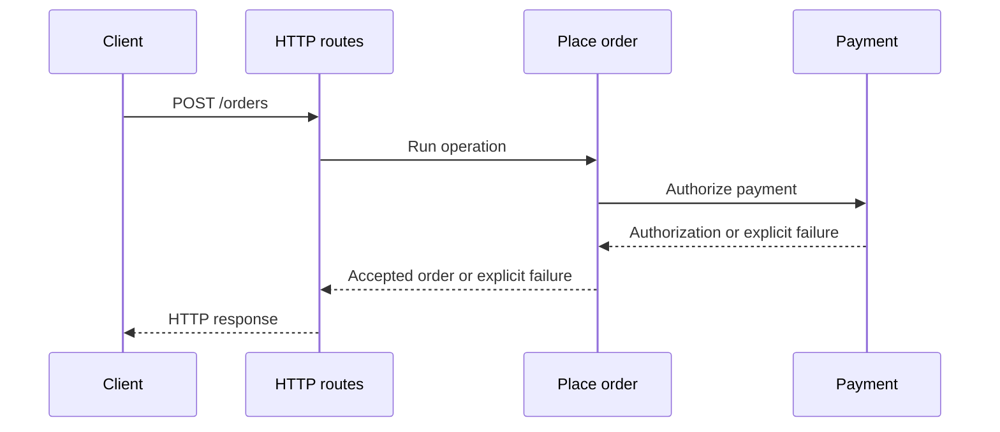

import {
  TutorialCheckpoint,
  EffectStrength,
} from "@astrojs/starlight/components"

<EffectStrength title="Expected failures stay visible in the type">

Backend operations can fail for different reasons. With ordinary Promise code,
these failures require separate conventions, while rejections reach `catch` as
`unknown`.

With Effect, the type system tracks expected failures as a union. When each
failure has a distinct tag, TypeScript can verify that every case is handled.

</EffectStrength>

## What you will build

The example is a `POST /orders` endpoint that calls a payment provider. It
starts with competent Promise code that distinguishes the provider's documented
errors. You will preserve that behavior while making the failure contract
explicit and retrying only temporary outages:

| Provider behavior                   | Decision            | HTTP result |
| ----------------------------------- | ------------------- | ----------- |
| Payment succeeds                    | Accept the order    | `201`       |
| Card is declined                    | Do not retry        | `422`       |
| Provider is temporarily unavailable | Retry at most twice | `201`/`503` |
| Provider fails unexpectedly         | Do not guess        | `502`       |

A checkpoint briefly summarizes the behavior reached by the current version
of the server.

## Request flow



## Project setup

The project uses two files:

| File         | Role                                                                     |
| ------------ | ------------------------------------------------------------------------ |
| `fixture.ts` | Fixed simulation of the external payment SDK. It never changes           |
| `server.ts`  | Local HTTP server and order-processing code. This is the file you change |

### The payment SDK fixture

The simulated SDK exposes one Promise-based function. A successful call returns
a payment authorization, which is the provider's confirmation that payment may
proceed. Its two error classes are the failures documented by the provider; any
other rejected value is undocumented.

```ts title="fixture.ts"
// This fixed payment SDK simulation does not change during the tutorial.
import { setTimeout as sleep } from "node:timers/promises"

export interface PaymentAuthorization {
  readonly provider: string
}

// These are the only failures documented by the simulated SDK.
export class PaymentDeclinedSdkError extends Error {}
export class ProviderUnavailableSdkError extends Error {}

// Preserve the flaky outage state across repeated authorization calls.
let flakyAttempts = 0

export const authorizePayment = async (
  token: string,
): Promise<PaymentAuthorization> => {
  const attempt = token === "tok_flaky" ? ++flakyAttempts : 1
  console.log(`primary-pay authorization attempt ${attempt}`)

  if (token === "tok_declined") throw new PaymentDeclinedSdkError()
  // Simulate a rejection that the SDK does not document.
  if (token === "tok_unexpected") {
    throw new Error("undocumented provider failure")
  }
  if (token === "tok_unavailable" || (token === "tok_flaky" && attempt < 3)) {
    throw new ProviderUnavailableSdkError()
  }

  await sleep(80)
  // Make the next flaky authorization repeat the same recovery sequence.
  if (token === "tok_flaky") flakyAttempts = 0
  return { provider: "primary-pay" }
}
```

The `token` argument is an opaque reference to the Customer's payment method.
In this fixture, its value also selects one deterministic behavior:

| Value             | Provider behavior                             |
| ----------------- | --------------------------------------------- |
| `tok_approved`    | Approves the payment                          |
| `tok_declined`    | Declines the payment                          |
| `tok_unavailable` | Reports a temporary failure on every attempt  |
| `tok_flaky`       | Reports two temporary failures, then succeeds |
| `tok_unexpected`  | Reports an undocumented failure               |

The `tok_flaky` counter resets after a successful authorization and whenever
the watched server reloads.

### The server you will improve

`server.ts` is the only file that changes. It contains the `POST /orders` route,
the `placeOrder` operation, and the code that turns its result into an HTTP
response. The starting version uses ordinary `async`/`await` throughout:

```ts title="server.ts"
import { createServer } from "node:http"
import {
  authorizePayment,
  PaymentDeclinedSdkError,
  ProviderUnavailableSdkError,
} from "./fixture.ts"

interface PlaceOrderInput {
  readonly customerId: string
  readonly paymentToken: string
}

interface HttpResult {
  readonly status: number
  readonly body: unknown
}

const json = (status: number, body: unknown): HttpResult => ({ status, body })

const placeOrder = async (input: PlaceOrderInput) => {
  const payment = await authorizePayment(input.paymentToken)
  return {
    orderId: `order-${input.customerId}`,
    status: "accepted" as const,
    paymentProvider: payment.provider,
  }
}

const handleOrderRequest = async (input: PlaceOrderInput) => {
  try {
    return json(201, await placeOrder(input))
  } catch (cause) {
    if (cause instanceof PaymentDeclinedSdkError) {
      return json(422, { error: "PaymentDeclined" })
    }
    if (cause instanceof ProviderUnavailableSdkError) {
      return json(503, { error: "PaymentProviderUnavailable" })
    }
    console.error(cause)
    return json(502, { error: "UnexpectedPaymentProviderError" })
  }
}

const server = createServer(async (request, response) => {
  const send = (result: HttpResult): void => {
    response.writeHead(result.status, { "content-type": "application/json" })
    response.end(JSON.stringify(result.body))
  }

  if (request.method !== "POST" || request.url !== "/orders") {
    send(json(404, { error: "NotFound" }))
    return
  }

  try {
    let body = ""
    for await (const chunk of request) body += chunk
    send(await handleOrderRequest(JSON.parse(body) as PlaceOrderInput))
  } catch (cause) {
    console.error(cause)
    send(json(500, { error: "InternalServerError" }))
  }
})

server.listen(3000, () => console.log("Listening on http://localhost:3000"))
```

During a local run, `--watch` reloads `server.ts` after each saved edit, so the
same command can remain running throughout the tutorial:

```sh title="Watched server"
node --watch server.ts
```

In a second terminal pane, changing `paymentToken` in this request selects one
of the fixture behaviors:

```sh title="Successful order request"
curl -i -sS http://localhost:3000/orders \
  -H 'content-type: application/json' \
  -d '{"customerId":"customer-123","paymentToken":"tok_approved"}'
```

## Make failures explicit in the type

### 1. Handle documented Promise failures

The starting server uses the error classes documented by the payment SDK. A
`catch` block receives `unknown`, then `instanceof` identifies the two known
failures and leaves a fallback for everything else:

| Token             | Actual cause                  | HTTP result |
| ----------------- | ----------------------------- | ----------- |
| `tok_declined`    | Final business decision       | `422`       |
| `tok_unavailable` | Temporary provider outage     | `503`       |
| `tok_unexpected`  | Undocumented provider failure | `502`       |

This is reasonable TypeScript and produces the correct HTTP responses. Its
`placeOrder` type, however, describes only the successful result:

```ts title="Inferred type, not code to copy"
type PlaceOrder = (input: PlaceOrderInput) => Promise<{
  orderId: string
  status: "accepted"
  paymentProvider: string
}>
```

Nothing in that type tells a caller about the two documented failures. Their
meaning exists only in the SDK documentation and in the `catch` block that
repeats it.

<TutorialCheckpoint
  number={1}
  total={3}
  title="Known failures are handled but not declared"
>
  The Promise baseline returns the correct HTTP response for every provider
  outcome, but its function type shows only the success value.
</TutorialCheckpoint>

### 2. Put failures in the function type

The next version preserves those HTTP decisions while making the possible
failures part of `placeOrder`'s type. `PaymentFailure` is an ordinary TypeScript
tagged union: every member has a `kind` property with a different literal value.
No new Effect-specific error class is needed:

```ts title="server.ts" ins={2,19-22,26-65,81-82} collapse={9-17,67-80,83-89}
import { createServer } from "node:http"
import { Effect } from "effect"
import {
  authorizePayment,
  PaymentDeclinedSdkError,
  ProviderUnavailableSdkError,
} from "./fixture.ts"

interface PlaceOrderInput {
  readonly customerId: string
  readonly paymentToken: string
}

interface HttpResult {
  readonly status: number
  readonly body: unknown
}

type PaymentFailure =
  | { readonly kind: "PaymentDeclined" }
  | { readonly kind: "PaymentProviderUnavailable" }
  | { readonly kind: "UnexpectedPaymentProviderError"; readonly cause: unknown }

const json = (status: number, body: unknown): HttpResult => ({ status, body })

const toPaymentFailure = (cause: unknown): PaymentFailure => {
  if (cause instanceof PaymentDeclinedSdkError) {
    return { kind: "PaymentDeclined" }
  }
  if (cause instanceof ProviderUnavailableSdkError) {
    return { kind: "PaymentProviderUnavailable" }
  }
  return { kind: "UnexpectedPaymentProviderError", cause }
}

const placeOrder = (input: PlaceOrderInput) =>
  Effect.tryPromise({
    try: async () => {
      const payment = await authorizePayment(input.paymentToken)
      return {
        orderId: `order-${input.customerId}`,
        status: "accepted" as const,
        paymentProvider: payment.provider,
      }
    },
    catch: toPaymentFailure,
  })

const failureResponse = (failure: PaymentFailure): HttpResult => {
  switch (failure.kind) {
    case "PaymentDeclined":
      return json(422, { error: failure.kind })
    case "PaymentProviderUnavailable":
      return json(503, { error: failure.kind })
    case "UnexpectedPaymentProviderError":
      return json(502, { error: failure.kind })
  }
  return failure satisfies never
}

const handleOrderRequest = (input: PlaceOrderInput) =>
  Effect.match(placeOrder(input), {
    onFailure: failureResponse,
    onSuccess: (order) => json(201, order),
  })

const server = createServer(async (request, response) => {
  const send = (result: HttpResult): void => {
    response.writeHead(result.status, { "content-type": "application/json" })
    response.end(JSON.stringify(result.body))
  }

  if (request.method !== "POST" || request.url !== "/orders") {
    send(json(404, { error: "NotFound" }))
    return
  }

  try {
    let body = ""
    for await (const chunk of request) body += chunk
    const input = JSON.parse(body) as PlaceOrderInput
    send(await Effect.runPromise(handleOrderRequest(input)))
  } catch (cause) {
    console.error(cause)
    send(json(500, { error: "InternalServerError" }))
  }
})

server.listen(3000, () => console.log("Listening on http://localhost:3000"))
```

`Effect.tryPromise` adapts a function that creates a Promise. Calling
`placeOrder` now creates an Effect value that describes the work without
calling the provider. When that Effect runs, a resolved Promise becomes a
success and `catch` translates a rejected value from `unknown` into a
`PaymentFailure`.

The concrete inferred type of `placeOrder(input)` is:

```ts title="Inferred type, not code to copy"
Effect.Effect<
  {
    orderId: string
    status: "accepted"
    paymentProvider: string
  },
  PaymentFailure
>
```

An Effect is a value that describes a computation. Its first type argument is
the value produced on success, which is the accepted order here. Its second
type argument records the expected failures and is called the error channel.
Creating or transforming this value does not execute the provider call.

The final line of `failureResponse` asks TypeScript to prove that the `switch`
handled every member of `PaymentFailure`. After all three cases, `failure` must
have the type `never`, meaning that no possible value remains. If another
payment failure is added to the union without a matching `case`, type checking
fails. TypeScript provides this exhaustive check; Effect preserves the complete
failure union in the error channel until the program makes that decision.

`Effect.match` creates a new Effect by transforming both possible outcomes. In
general, `onSuccess` receives the success value and `onFailure` receives an
expected failure. Here, they both return an `HttpResult`, so the resulting
Effect can no longer fail with `PaymentFailure`. `Effect.match` does not run the
computation.

`Effect.runPromise` runs the computation at the HTTP boundary and returns a
Promise. In this case, that Promise resolves with the `HttpResult` produced by
`Effect.match`.

The HTTP behavior is unchanged:

| Token             | HTTP result | Body                                         |
| ----------------- | ----------- | -------------------------------------------- |
| `tok_approved`    | `201`       | accepted order                               |
| `tok_declined`    | `422`       | `{"error":"PaymentDeclined"}`                |
| `tok_unavailable` | `503`       | `{"error":"PaymentProviderUnavailable"}`     |
| `tok_unexpected`  | `502`       | `{"error":"UnexpectedPaymentProviderError"}` |

<TutorialCheckpoint
  number={2}
  total={3}
  title="The failure contract is visible"
>
  The endpoint still returns `422`, `503`, or `502`. The type of `placeOrder`
  records every expected payment failure, and TypeScript verifies that the HTTP
  boundary handles every member of the union.
</TutorialCheckpoint>

### 3. Retry only what can recover

A temporary provider outage may recover, while a declined payment or an
undocumented failure must remain final. The final version gives the provider
call a recovery policy:

```ts title="server.ts" ins={36-37,49-53} collapse={1-35,55-95}
import { createServer } from "node:http"
import { Effect } from "effect"
import {
  authorizePayment,
  PaymentDeclinedSdkError,
  ProviderUnavailableSdkError,
} from "./fixture.ts"

interface PlaceOrderInput {
  readonly customerId: string
  readonly paymentToken: string
}

interface HttpResult {
  readonly status: number
  readonly body: unknown
}

type PaymentFailure =
  | { readonly kind: "PaymentDeclined" }
  | { readonly kind: "PaymentProviderUnavailable" }
  | { readonly kind: "UnexpectedPaymentProviderError"; readonly cause: unknown }

const json = (status: number, body: unknown): HttpResult => ({ status, body })

const toPaymentFailure = (cause: unknown): PaymentFailure => {
  if (cause instanceof PaymentDeclinedSdkError) {
    return { kind: "PaymentDeclined" }
  }
  if (cause instanceof ProviderUnavailableSdkError) {
    return { kind: "PaymentProviderUnavailable" }
  }
  return { kind: "UnexpectedPaymentProviderError", cause }
}

const placeOrder = (input: PlaceOrderInput) => {
  const attempt = Effect.tryPromise({
    try: async () => {
      const payment = await authorizePayment(input.paymentToken)
      return {
        orderId: `order-${input.customerId}`,
        status: "accepted" as const,
        paymentProvider: payment.provider,
      }
    },
    catch: toPaymentFailure,
  })

  return Effect.retry(attempt, {
    times: 2,
    while: (failure) => failure.kind === "PaymentProviderUnavailable",
  })
}

const failureResponse = (failure: PaymentFailure): HttpResult => {
  switch (failure.kind) {
    case "PaymentDeclined":
      return json(422, { error: failure.kind })
    case "PaymentProviderUnavailable":
      return json(503, { error: failure.kind })
    case "UnexpectedPaymentProviderError":
      return json(502, { error: failure.kind })
  }
  return failure satisfies never
}

const handleOrderRequest = (input: PlaceOrderInput) =>
  Effect.match(placeOrder(input), {
    onFailure: failureResponse,
    onSuccess: (order) => json(201, order),
  })

const server = createServer(async (request, response) => {
  const send = (result: HttpResult): void => {
    response.writeHead(result.status, { "content-type": "application/json" })
    response.end(JSON.stringify(result.body))
  }

  if (request.method !== "POST" || request.url !== "/orders") {
    send(json(404, { error: "NotFound" }))
    return
  }

  try {
    let body = ""
    for await (const chunk of request) body += chunk
    const input = JSON.parse(body) as PlaceOrderInput
    send(await Effect.runPromise(handleOrderRequest(input)))
  } catch (cause) {
    console.error(cause)
    send(json(500, { error: "InternalServerError" }))
  }
})

server.listen(3000, () => console.log("Listening on http://localhost:3000"))
```

`Effect.retry` reruns the preceding computation after selected failures. Here,
`times: 2` permits two retries after the first attempt, while `while` permits
them only for `PaymentProviderUnavailable`. A declined payment and an
undocumented failure still run once.

With `tok_flaky`, the fixture makes the first two attempts fail. The server log
then shows the recovery before the endpoint returns `201`:

```text title="Observable server log"
primary-pay authorization attempt 1
primary-pay authorization attempt 2
primary-pay authorization attempt 3
```

`tok_unavailable` uses the same retry policy but fails on all three attempts,
so the final result remains `503`.

<TutorialCheckpoint
  number={3}
  total={3}
  title="Only temporary failures are retried"
>
  A temporary outage gets at most three total attempts. A declined payment and
  an undocumented provider failure are never retried.
</TutorialCheckpoint>

## Related tutorials

- [Keep concurrent work under control](/docs/v4/tutorials/keep-concurrent-work-under-control)
- [Clean up resources reliably](/docs/v4/tutorials/clean-up-resources-reliably)
