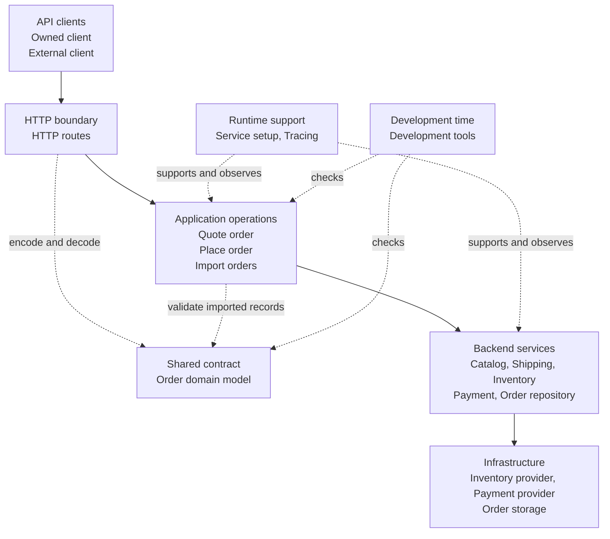

The tutorials in this section are independent. Each title names the positive
outcome the tutorial builds. You can begin with whichever underlying problem
is most familiar without reading the others first.

They all use the same general scenario: a TypeScript backend that quotes and
processes customer orders. Keeping that scenario stable makes it easier to see
how different Effect capabilities solve different production problems.

## The scenario

A customer sends an order containing:

- the customer identifier;
- one or more catalog items and their quantities;
- a delivery destination;
- an opaque payment token.

The backend can perform three operations:

- `POST /quotes` prices the order lines and shipping;
- `POST /orders` reserves inventory, authorizes payment, and stores the order;
- `POST /orders/import` validates order records received from another system.

An order is accepted only after every required stage succeeds. The application
generates its Order ID. The payment token is confidential and never belongs in
logs, traces, or responses.

The responsibilities stay separated across four parts of the application:

- the HTTP boundary reads requests and sends responses;
- application operations coordinate quoting, placing, and importing orders;
- Catalog, Shipping, Inventory, Payment, and Order Repository services isolate
  backend integrations;
- service setup and tracing support the running application;
- development tools check the application before it runs.

## Architecture

The tables define the stable system structure, the direction of its
relationships, and the parts covered by each tutorial. A tutorial keeps the
remaining parts behind simple fixtures so they do not distract from its
lesson.

This diagram provides an overview of how a request moves from a client through
the application and into its backend services. The tables below define the
responsibilities in more detail.

### API clients

| Component       | Sends requests to | Contract                                   |
| --------------- | ----------------- | ------------------------------------------ |
| Owned client    | HTTP routes       | JSON derived from the shared Order Schema  |
| External client | HTTP routes       | Fixed JSON required by the external system |

### Order application

| Component          | Called by                  | Calls or depends on                               | Responsibility                                                    |
| ------------------ | -------------------------- | ------------------------------------------------- | ----------------------------------------------------------------- |
| HTTP routes        | API clients                | Quote order, Place order, Import orders           | Decode requests, run operations, and encode results               |
| Order domain model | HTTP routes, Import orders | None                                              | Connect rich domain values to JSON representations                |
| Quote order        | HTTP routes, Place order   | Catalog, Shipping                                 | Price order lines and shipping                                    |
| Place order        | HTTP routes                | Quote order, Inventory, Payment, Order repository | Reserve inventory, authorize payment, and store an accepted order |
| Import orders      | HTTP routes                | Order domain model                                | Validate records from an external system                          |
| Catalog            | Quote order                | None                                              | Price an order line                                               |
| Shipping           | Quote order                | None                                              | Quote delivery                                                    |
| Inventory          | Place order                | Inventory provider                                | Reserve stock                                                     |
| Payment            | Place order                | Payment provider                                  | Authorize payment                                                 |
| Order repository   | Place order                | Order storage                                     | Store and retrieve orders                                         |

### Runtime support

| Capability    | Applies to                                    | Responsibility                                                                     |
| ------------- | --------------------------------------------- | ---------------------------------------------------------------------------------- |
| Service setup | Application operations and backend services   | Select implementations, build them once, and share them while the application runs |
| Tracing       | HTTP routes, operations, and backend services | Record timing and parent relationships without changing their contracts            |

### Development time

| Capability        | Applies before   | Responsibility                                                   |
| ----------------- | ---------------- | ---------------------------------------------------------------- |
| Development tools | Application runs | Check TypeScript and Effect-specific structure before code ships |

## Tutorials

| Tutorial                                                                                                                                            | Outcome                                                                                                                      | Architecture focus                                                 |
| --------------------------------------------------------------------------------------------------------------------------------------------------- | ---------------------------------------------------------------------------------------------------------------------------- | ------------------------------------------------------------------ |
| [Handle failures without guessing](/docs/v4/tutorials/handle-failures-without-guessing)                                                             | Distinguish payment failures, retry recoverable outages, apply a timeout, and stop after a client disconnects                | HTTP routes, Place order, Payment                                  |
| [Keep concurrent work under control](/docs/v4/tutorials/keep-concurrent-work-under-control)                                                         | Coordinate catalog and shipping work with bounded concurrency, stable result order, one deadline, and automatic cancellation | HTTP routes, Quote order, Catalog, Shipping                        |
| [Clean up resources reliably](/docs/v4/tutorials/clean-up-resources-reliably)                                                                       | Close database and inventory resources after success, failure, or cancellation                                               | Place order, Inventory, Order repository                           |
| [Send rich domain models over the wire](/docs/v4/tutorials/send-rich-domain-models-over-the-wire)                                                   | Derive JSON for clients that share the Schema while preserving explicit external representations                             | API clients, HTTP routes, Order domain model                       |
| [Keep dependencies explicit without manual wiring](/docs/v4/tutorials/keep-dependencies-explicit-without-manual-wiring)                             | Keep service requirements visible while selecting their implementations in one place                                         | HTTP routes, Place order, Payment, Order repository, Service setup |
| [Catch AI slop before it ships](/docs/v4/tutorials/catch-ai-slop-before-it-ships)                                                                   | Expose plausible but incorrect generated code with precise types and Effect-aware development tools                          | HTTP routes, Import orders, Order domain model, Development tools  |
| [Instrument applications for OpenTelemetry without the plumbing](/docs/v4/tutorials/instrument-applications-for-opentelemetry-without-the-plumbing) | Record operation timing and relationships without manually passing tracing context                                           | HTTP routes, Place order, backend services, Tracing                |

Each tutorial presents only the part of the backend required to reach its
outcome. The names and responsibilities in these tables remain stable, even
when a fixture hides the rest of the application.
