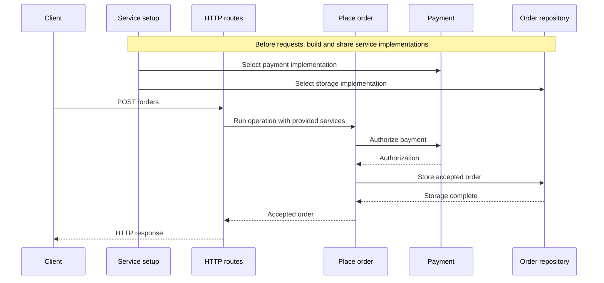

import {
  TutorialCheckpoint,
  TutorialPainPoint,
} from "@astrojs/starlight/components"

<TutorialPainPoint title="Dependency injection trades plumbing for magic">
  Passing dependencies through function arguments keeps them explicit, but
  spreads manual wiring through code that does not use them. Dependency
  injection containers reduce that plumbing through tokens, decorators, or
  global lookups, but make the dependency graph more implicit.

With Effect, an operation's type records the services it needs. The application
selects their implementations once when it starts, instead of passing them
through every intermediate function. The dependencies remain visible to
TypeScript throughout.

</TutorialPainPoint>

## What you will build

The example is a `POST /orders` endpoint that authorizes a payment and saves an
order. It starts with an HTTP handler that selects both infrastructure
implementations and passes them to the order logic. Each step moves that
selection out of the handler until changing the payment provider requires one
line at the application boundary.

The same request makes the final change visible:

| Application setup | HTTP status | `paymentProvider` |
| ----------------- | ----------- | ----------------- |
| Primary payment   | `201`       | `primary-pay`     |
| Backup payment    | `201`       | `backup-pay`      |

## Where this tutorial fits

The table identifies the parts of the shared order-processing system covered by
this tutorial. See the [complete architecture](/docs/v4/tutorials/introduction#architecture)
for the full system.

| Part                         | Area                  | Role in this tutorial                                         |
| ---------------------------- | --------------------- | ------------------------------------------------------------- |
| HTTP routes                  | HTTP boundary         | Run Place order with implementations selected at startup      |
| Place order                  | Application operation | Declare its Payment and Order repository requirements         |
| Payment and Order repository | Backend services      | Provide stable contracts independent of their implementations |
| Service setup                | Runtime support       | Select, build, and share the implementations                  |

### Request flow



## Project setup

The project uses two files:

| File         | Role                                                                               |
| ------------ | ---------------------------------------------------------------------------------- |
| `fixture.ts` | Fixed fixture that provides the HTTP server, payment providers, and order storage. |
| `server.ts`  | Contains the order logic and infrastructure setup the tutorial improves.           |

`fixture.ts` does not change. It exports:

- `startServer`, which exposes the order function as `POST /orders` and turns
  its result into an HTTP response;
- `paymentProviders.primary` and `paymentProviders.backup`, which implement the
  same Promise-based provider contract and identify themselves in the accepted
  order;
- `consoleOrderStorage`, which records the saved order in the terminal.

`paymentToken` is a string that identifies the customer's payment method
without exposing card details. Both deterministic payment implementations
accept any token because this tutorial focuses on selecting infrastructure,
not on handling payment outcomes.

An `AbortSignal` is a standard cancellation value. The payment and storage
contracts accept one so their pending Promise work can be stopped.

```ts title="fixture.ts"
// This fixed fixture does not change during the tutorial.
import { createServer } from "node:http"
import { setTimeout as sleep } from "node:timers/promises"

export interface PlaceOrderRequest {
  readonly customerId: string
  readonly quantity: number
  readonly paymentToken: string
}

export interface AcceptedOrder {
  readonly orderId: string
  readonly status: "accepted"
  readonly totalCents: number
  readonly paymentProvider: string
}

export interface PaymentAuthorization {
  readonly provider: string
}

export interface PaymentProvider {
  readonly authorize: (input: {
    readonly operationId: string
    readonly amountCents: number
    readonly paymentToken: string
    readonly signal?: AbortSignal
  }) => Promise<PaymentAuthorization>
}

export interface OrderStorage {
  readonly save: (
    order: AcceptedOrder,
    options?: { readonly signal?: AbortSignal },
  ) => Promise<void>
}

// The HTTP fixture calls the order function without selecting its dependencies.
export const startServer = (
  placeOrder: (input: PlaceOrderRequest) => Promise<AcceptedOrder>,
): void => {
  const server = createServer(async (request, response) => {
    const sendJson = (status: number, body: unknown): void => {
      response.writeHead(status, { "content-type": "application/json" })
      response.end(JSON.stringify(body))
    }

    if (request.method !== "POST" || request.url !== "/orders") {
      sendJson(404, { error: "NotFound" })
      return
    }

    try {
      let body = ""
      for await (const chunk of request) body += chunk
      const order = await placeOrder(JSON.parse(body) as PlaceOrderRequest)
      sendJson(201, order)
    } catch (error) {
      console.error(error)
      sendJson(500, { error: "InternalServerError" })
    }
  })

  server.listen(3000, () => console.log("Listening on http://localhost:3000"))
}

// Both implementations reveal which one handled the authorization.
export const paymentProviders = {
  primary: {
    authorize: async ({ operationId, signal }) => {
      console.log(`primary-pay authorization for ${operationId}`)
      await sleep(40, undefined, { signal })
      return { provider: "primary-pay" }
    },
  },
  backup: {
    authorize: async ({ operationId, signal }) => {
      console.log(`backup-pay authorization for ${operationId}`)
      await sleep(40, undefined, { signal })
      return { provider: "backup-pay" }
    },
  },
} satisfies Record<"primary" | "backup", PaymentProvider>

export const consoleOrderStorage: OrderStorage = {
  save: async (order, { signal } = {}) => {
    await sleep(20, undefined, { signal })
    console.log(`saved ${order.orderId}`)
  },
}
```

Run the server with `--watch`. This option reloads `server.ts` after each saved
edit, so the same process can remain running throughout the tutorial:

```sh title="Watched server"
node --watch server.ts
```

## The solution, step by step

### 1. Start with direct dependencies

The initial `server.ts` uses conventional `async`/`await`. `placeOrder`
receives its payment provider and order storage as ordinary function arguments:

```ts title="server.ts"
import {
  consoleOrderStorage,
  paymentProviders,
  startServer,
  type AcceptedOrder,
  type OrderStorage,
  type PaymentProvider,
  type PlaceOrderRequest,
} from "./fixture.ts"

const placeOrder = async (
  input: PlaceOrderRequest,
  dependencies: {
    readonly payment: PaymentProvider
    readonly orders: OrderStorage
  },
): Promise<AcceptedOrder> => {
  const totalCents = 1_250 * input.quantity
  const authorization = await dependencies.payment.authorize({
    operationId: input.customerId,
    amountCents: totalCents,
    paymentToken: input.paymentToken,
  })

  const order: AcceptedOrder = {
    orderId: `order-${input.customerId}`,
    status: "accepted",
    totalCents,
    paymentProvider: authorization.provider,
  }

  await dependencies.orders.save(order)
  return order
}

// The HTTP entry point selects and forwards every implementation.
startServer((input) =>
  placeOrder(input, {
    payment: paymentProviders.primary,
    orders: consoleOrderStorage,
  }),
)
```

In a second terminal pane, this request places an order:

```sh title="Successful order request"
curl -i -sS http://localhost:3000/orders \
  -H 'content-type: application/json' \
  -d '{"customerId":"customer-123","quantity":2,"paymentToken":"tok_approved"}'
```

The response contains the provider selected by `server.ts`:

```text title="Expected response"
HTTP/1.1 201 Created
...

{"orderId":"order-customer-123","status":"accepted","totalCents":2500,"paymentProvider":"primary-pay"}
```

The server terminal also shows both infrastructure operations:

```text title="Expected server output"
primary-pay authorization for customer-123
saved order-customer-123
```

<TutorialCheckpoint
  number={1}
  total={6}
  title="The direct-dependency endpoint works"
>
  An approved order returns `201` through the primary provider, and the storage
  implementation records the order.
</TutorialCheckpoint>

Passing dependencies directly is reasonable at this size. The cost is already
visible, however:

- the HTTP entry point chooses `paymentProviders.primary` and
  `consoleOrderStorage`;
- it builds a dependency object;
- it forwards that object to `placeOrder`, even though HTTP handling does not
  use either implementation.

As more operations and infrastructure appear, the same dependencies must pass
through more callers. We want `placeOrder` to retain explicit requirements
without making every caller carry those requirements as ordinary arguments.

### 2. Describe the order operation with Effect

Moving the dependencies and introducing Effect in the same step would obscure
what changed. First, keep both direct arguments and change only how
`placeOrder` describes its asynchronous work:

```ts title="server.ts" ins={10,12,18-26,28-33,35-37,39,41-46}
import {
  consoleOrderStorage,
  paymentProviders,
  startServer,
  type AcceptedOrder,
  type OrderStorage,
  type PaymentProvider,
  type PlaceOrderRequest,
} from "./fixture.ts"
import { Effect } from "effect"

const placeOrder = (
  input: PlaceOrderRequest,
  dependencies: {
    readonly payment: PaymentProvider
    readonly orders: OrderStorage
  },
) =>
  Effect.tryPromise(async (signal) => {
    const totalCents = 1_250 * input.quantity
    const authorization = await dependencies.payment.authorize({
      operationId: input.customerId,
      amountCents: totalCents,
      paymentToken: input.paymentToken,
      signal,
    })

    const order: AcceptedOrder = {
      orderId: `order-${input.customerId}`,
      status: "accepted",
      totalCents,
      paymentProvider: authorization.provider,
    }

    await dependencies.orders.save(order, { signal })
    return order
  })

// The HTTP entry point still selects and forwards every implementation.
startServer((input) =>
  Effect.runPromise(
    placeOrder(input, {
      payment: paymentProviders.primary,
      orders: consoleOrderStorage,
    }),
  ),
)
```

`placeOrder` now returns this inferred type:

```ts title="Inferred type, not code to paste"
Effect.Effect<AcceptedOrder, Cause.UnknownError>
```

An Effect is a value that describes a computation. Calling `placeOrder` creates
that description, but does not authorize a payment, save an order, or perform
another side effect. [`Effect.Effect`](/docs/v4/api/effect/Effect#Effect) is the
type of the description:

- `AcceptedOrder` is the value produced when the computation succeeds;
- `Cause.UnknownError` is the error channel, which contains expected ways the
  computation can fail at this point.

There is no third type argument yet. Both implementations are supplied as
ordinary arguments before the Effect is created, so the computation has no
service requirement.

[`Effect.tryPromise`](/docs/v4/api/effect/Effect#tryPromise) adapts the two
Promise calls. Its behavior in this code is:

- the async function remains inactive until the Effect runs;
- a resolved Promise becomes an Effect success;
- a rejected Promise enters the error channel;
- Effect supplies an `AbortSignal`, which is passed to both Promise APIs so an
  interrupted computation can cancel their waits.

Interruption is Effect's name for cancelling a running computation. A defect is
an unexpected bug, distinct from an expected failure in the error channel.

[`Cause.UnknownError`](/docs/v4/api/effect/Cause#UnknownError-interface) is
Effect's built-in wrapper for a Promise rejection that has not been classified.
Its `cause` property preserves the original rejected value. Classifying
failures is a separate error-handling lesson, so this endpoint continues to
return `500` if either implementation rejects.

[`Effect.runPromise`](/docs/v4/api/effect/Effect#runPromise) runs the described
computation at the HTTP entry point and returns a Promise. That Promise resolves
with the accepted order or rejects when the Effect does not succeed. It can
also receive an external `AbortSignal` when a caller needs to interrupt the
computation.

Repeating the request produces the same response and terminal messages. This
step changes how the operation is described and run, not how its dependencies
are selected.

<TutorialCheckpoint
  number={2}
  total={6}
  title="Effect describes the direct-dependency operation"
>
  The approved order still returns `201` through `primary-pay`. `placeOrder` now
  returns an Effect, while the same dependency object still supplies both
  implementations.
</TutorialCheckpoint>

### 3. Make payment a service requirement

The dependency object still crosses the HTTP boundary. Replace only its
payment entry with a `Context` service. Order storage remains an ordinary
argument for one more step, making the effect of this change visible:

```ts title="server.ts" ins={7,11,13-28,30-65}
import {
  consoleOrderStorage,
  paymentProviders,
  startServer,
  type AcceptedOrder,
  type OrderStorage,
  type PaymentAuthorization,
  type PaymentProvider,
  type PlaceOrderRequest,
} from "./fixture.ts"
import { Cause, Context, Effect } from "effect"

interface Payment {
  readonly authorize: (input: {
    readonly operationId: string
    readonly amountCents: number
    readonly paymentToken: string
  }) => Effect.Effect<PaymentAuthorization, Cause.UnknownError>
}

// The service key connects the TypeScript contract to a runtime implementation.
const Payment = Context.Service<Payment>("tutorial/Payment")

// Infrastructure adapters keep Promise APIs behind the service contract.
const paymentFromProvider = (provider: PaymentProvider): Payment => ({
  authorize: (input) =>
    Effect.tryPromise((signal) => provider.authorize({ ...input, signal })),
})

const placeOrder = (input: PlaceOrderRequest, orders: OrderStorage) =>
  Payment.use((payment) => {
    const totalCents = 1_250 * input.quantity
    return payment
      .authorize({
        operationId: input.customerId,
        amountCents: totalCents,
        paymentToken: input.paymentToken,
      })
      .pipe(
        Effect.flatMap((authorization) =>
          Effect.tryPromise(async (signal) => {
            const order: AcceptedOrder = {
              orderId: `order-${input.customerId}`,
              status: "accepted",
              totalCents,
              paymentProvider: authorization.provider,
            }

            await orders.save(order, { signal })
            return order
          }),
        ),
      )
  })

// The HTTP entry point still selects both implementations.
startServer((input) =>
  Effect.runPromise(
    Effect.provideService(
      placeOrder(input, consoleOrderStorage),
      Payment,
      paymentFromProvider(paymentProviders.primary),
    ),
  ),
)
```

`PaymentProvider` remains the Promise-based external SDK contract from the
fixture. The new `Payment` interface is the application service contract, and
its `authorize` method returns an Effect instead of exposing that Promise.

The interface and the `const` are both named `Payment`. TypeScript keeps types
and runtime values in separate namespaces:

- the interface remains the contract that an implementation must satisfy;
- the `const` is a runtime key used to find an implementation of that contract.

[`Context.Service`](/docs/v4/api/effect/Context#Service-variable) creates the
typed key. Its string is the runtime identity and must be unique.
[`Payment.use`](/docs/v4/api/effect/Context#Service-variable) describes reading
the implementation stored under that key and passing it to the callback. It
does not read a global value or run the callback immediately.

The [`.pipe(...)` method](/docs/v4/api/effect/Pipeable#Pipeable) passes an Effect
description through transformations from top to bottom without running it. Here
it passes the payment authorization to `Effect.flatMap`.

`paymentFromProvider` is the infrastructure adapter. It uses
[`Effect.tryPromise`](/docs/v4/api/effect/Effect#tryPromise) to turn one
`PaymentProvider` into the Effect-based `Payment` service. Rejected provider
Promises become `Cause.UnknownError`, and interruption reaches the provider
through its `AbortSignal`.

[`Effect.flatMap`](/docs/v4/api/effect/Effect#flatMap) uses the successful
`PaymentAuthorization` to describe the storage operation that must run next.
If authorization fails, the callback is not run and the same failure remains
in the error channel.

`placeOrder(input, consoleOrderStorage)` now returns this inferred type:

```ts title="Inferred type, not code to paste"
Effect.Effect<AcceptedOrder, Cause.UnknownError, Payment>
```

The success and error types are unchanged. The third type argument is the
service that must be supplied before the computation can run. This requirement
remains visible while Effect values are combined.

[`Effect.provideService`](/docs/v4/api/effect/Effect#provideService) supplies
one existing implementation for a matching service key. Here it supplies the
primary provider adapter and removes `Payment` from the remaining requirements.

The same request still returns `primary-pay`. The HTTP entry point supplies the
payment implementation, but it no longer passes that implementation as a
business-function argument.

<TutorialCheckpoint
  number={3}
  total={6}
  title="Payment is an explicit service requirement"
>
  The order still returns `201` through `primary-pay`. The Effect type records
  the payment requirement, while order storage remains an ordinary argument.
</TutorialCheckpoint>

### 4. Move the repository requirement too

The remaining `orders` parameter still makes the HTTP entry point select and
forward order storage. Introduce the `OrderRepository` service, adapt the
storage implementation behind it, and read that service inside the same
computation:

```ts title="server.ts" collapse={1-25} ins={27-41,43-79}
import {
  consoleOrderStorage,
  paymentProviders,
  startServer,
  type AcceptedOrder,
  type OrderStorage,
  type PaymentAuthorization,
  type PaymentProvider,
  type PlaceOrderRequest,
} from "./fixture.ts"
import { Cause, Context, Effect } from "effect"

interface Payment {
  readonly authorize: (input: {
    readonly operationId: string
    readonly amountCents: number
    readonly paymentToken: string
  }) => Effect.Effect<PaymentAuthorization, Cause.UnknownError>
}
const Payment = Context.Service<Payment>("tutorial/Payment")

const paymentFromProvider = (provider: PaymentProvider): Payment => ({
  authorize: (input) =>
    Effect.tryPromise((signal) => provider.authorize({ ...input, signal })),
})

interface OrderRepository {
  readonly save: (
    order: AcceptedOrder,
  ) => Effect.Effect<AcceptedOrder, Cause.UnknownError>
}
const OrderRepository = Context.Service<OrderRepository>(
  "tutorial/OrderRepository",
)

const ordersFromStorage = (storage: OrderStorage): OrderRepository => ({
  save: (order) =>
    Effect.tryPromise((signal) => storage.save(order, { signal })).pipe(
      Effect.map(() => order),
    ),
})

const placeOrder = (input: PlaceOrderRequest) =>
  Payment.use((payment) =>
    OrderRepository.use((orders) => {
      const totalCents = 1_250 * input.quantity
      return payment
        .authorize({
          operationId: input.customerId,
          amountCents: totalCents,
          paymentToken: input.paymentToken,
        })
        .pipe(
          Effect.flatMap((authorization) =>
            orders.save({
              orderId: `order-${input.customerId}`,
              status: "accepted",
              totalCents,
              paymentProvider: authorization.provider,
            }),
          ),
        )
    }),
  )

// The HTTP entry point supplies both services instead of passing arguments.
startServer((input) =>
  Effect.runPromise(
    Effect.provideService(
      Effect.provideService(
        placeOrder(input),
        Payment,
        paymentFromProvider(paymentProviders.primary),
      ),
      OrderRepository,
      ordersFromStorage(consoleOrderStorage),
    ),
  ),
)
```

`Context` is the typed collection from which an Effect reads services. A
service key identifies one entry in that collection. The value stored under
`OrderRepository` must satisfy the `OrderRepository` interface, connecting the
runtime lookup to TypeScript's compile-time checks.

`OrderStorage` remains the Promise-based infrastructure contract. The new
`OrderRepository` service exposes an Effect operation instead.
`ordersFromStorage` adapts the storage Promise with `Effect.tryPromise` and
forwards interruption through the `AbortSignal`.

[`Effect.map`](/docs/v4/api/effect/Effect#map) transforms the successful
`undefined` returned by storage into the accepted order. It leaves
`Cause.UnknownError` unchanged, so a rejected storage Promise remains visible
in the error channel.

The inferred type of `placeOrder(input)` now shows both requirements:

```ts title="Inferred type, not code to paste"
Effect.Effect<AcceptedOrder, Cause.UnknownError, Payment | OrderRepository>
```

The union in the third type argument means the computation needs both services.
It does not mean either service is optional.
[`Payment.use`](/docs/v4/api/effect/Context#Service-variable) and
[`OrderRepository.use`](/docs/v4/api/effect/Context#Service-variable) each add
their key to that union.

The handler no longer passes infrastructure to `placeOrder`, but the two nested
`Effect.provideService` calls repeat the setup for individual services. The next
step replaces those calls with one reusable description of the complete
application setup.

The request still returns the primary provider, and the repository still logs
the saved order.

<TutorialCheckpoint
  number={4}
  total={6}
  title="Business logic declares both services"
>
  `placeOrder` now receives only its business input. Its Effect type records the
  payment and repository requirements, and the request still returns `201`.
</TutorialCheckpoint>

### 5. Combine implementations with Layer

A `Context` key describes what a computation needs. We still need one place to
describe how all implementations are selected. Replace the individual
`Effect.provideService` calls with Layers and combine them into `AppLive`:

```ts title="server.ts" collapse={1-64} ins={11,66-80}
import {
  consoleOrderStorage,
  paymentProviders,
  startServer,
  type AcceptedOrder,
  type OrderStorage,
  type PaymentAuthorization,
  type PaymentProvider,
  type PlaceOrderRequest,
} from "./fixture.ts"
import { Cause, Context, Effect, Layer } from "effect"

interface Payment {
  readonly authorize: (input: {
    readonly operationId: string
    readonly amountCents: number
    readonly paymentToken: string
  }) => Effect.Effect<PaymentAuthorization, Cause.UnknownError>
}
const Payment = Context.Service<Payment>("tutorial/Payment")

const paymentFromProvider = (provider: PaymentProvider): Payment => ({
  authorize: (input) =>
    Effect.tryPromise((signal) => provider.authorize({ ...input, signal })),
})

interface OrderRepository {
  readonly save: (
    order: AcceptedOrder,
  ) => Effect.Effect<AcceptedOrder, Cause.UnknownError>
}
const OrderRepository = Context.Service<OrderRepository>(
  "tutorial/OrderRepository",
)

const ordersFromStorage = (storage: OrderStorage): OrderRepository => ({
  save: (order) =>
    Effect.tryPromise((signal) => storage.save(order, { signal })).pipe(
      Effect.map(() => order),
    ),
})

const placeOrder = (input: PlaceOrderRequest) =>
  Payment.use((payment) =>
    OrderRepository.use((orders) => {
      const totalCents = 1_250 * input.quantity
      return payment
        .authorize({
          operationId: input.customerId,
          amountCents: totalCents,
          paymentToken: input.paymentToken,
        })
        .pipe(
          Effect.flatMap((authorization) =>
            orders.save({
              orderId: `order-${input.customerId}`,
              status: "accepted",
              totalCents,
              paymentProvider: authorization.provider,
            }),
          ),
        )
    }),
  )

// The application Layer selects every infrastructure implementation.
const PaymentLive = Layer.succeed(
  Payment,
  paymentFromProvider(paymentProviders.primary),
)
const OrdersLive = Layer.succeed(
  OrderRepository,
  ordersFromStorage(consoleOrderStorage),
)
const AppLive = Layer.merge(PaymentLive, OrdersLive)

// The HTTP boundary provides the complete service graph.
startServer((input) =>
  Effect.runPromise(Effect.provide(placeOrder(input), AppLive)),
)
```

A Layer is a value that describes how to construct one or more services. Like
an Effect, creating a Layer does not perform side effects. The adapter
functions create these service values from existing fixture values, so their
Layers cannot fail and do not require other services.

[`Layer.succeed`](/docs/v4/api/effect/Layer#succeed) creates a Layer for one
already-available service value:

- `PaymentLive` associates `paymentProviders.primary` with the
  `Payment` key through `paymentFromProvider`;
- `OrdersLive` associates `consoleOrderStorage` with the `OrderRepository` key
  through `ordersFromStorage`.

[`Layer.merge`](/docs/v4/api/effect/Layer#merge) combines two independent Layers
into one Layer that provides both sets of services. `AppLive` therefore
describes the complete set of services used by this application.

The inferred type shows the services provided by `AppLive`:

```ts title="Inferred type, not code to paste"
Layer.Layer<Payment | OrderRepository>
```

[`Layer.Layer`](/docs/v4/api/effect/Layer#Layer) is the type of a Layer
description. Its first type argument lists the services the Layer provides.
Additional type arguments can describe construction failures and services
required to construct it. Both default to `never` here because `Layer.succeed`
uses existing values.

[`Effect.provide`](/docs/v4/api/effect/Effect#provide) constructs the supplied
Layer and makes its services available to the Effect. Here it satisfies both
requirements of `placeOrder`, so `Effect.runPromise` can run the resulting
Effect.

This is the application boundary: `AppLive` selects concrete infrastructure,
while `placeOrder` names only service contracts. If `OrdersLive` were omitted,
`OrderRepository` would remain in the Effect's requirement type and
`Effect.runPromise` would not type-check. The missing service is detected before
the server starts.

The same request still returns `primary-pay`; this step changes where the
implementations are selected, not the observable behavior.

<TutorialCheckpoint
  number={5}
  total={6}
  title="One Layer provides every service"
>
  `AppLive` adapts the primary payment provider and console storage into the two
  application services. The request returns `201`, and no individual service is
  supplied in the HTTP entry point.
</TutorialCheckpoint>

### 6. Replace the payment implementation

The backup fixture satisfies the same `PaymentProvider` SDK contract. Adapt it
to `Payment` by changing only the provider passed to `paymentFromProvider`:

```ts title="server.ts" collapse={1-66,71-80} ins={69}
import {
  consoleOrderStorage,
  paymentProviders,
  startServer,
  type AcceptedOrder,
  type OrderStorage,
  type PaymentAuthorization,
  type PaymentProvider,
  type PlaceOrderRequest,
} from "./fixture.ts"
import { Cause, Context, Effect, Layer } from "effect"

interface Payment {
  readonly authorize: (input: {
    readonly operationId: string
    readonly amountCents: number
    readonly paymentToken: string
  }) => Effect.Effect<PaymentAuthorization, Cause.UnknownError>
}
const Payment = Context.Service<Payment>("tutorial/Payment")

const paymentFromProvider = (provider: PaymentProvider): Payment => ({
  authorize: (input) =>
    Effect.tryPromise((signal) => provider.authorize({ ...input, signal })),
})

interface OrderRepository {
  readonly save: (
    order: AcceptedOrder,
  ) => Effect.Effect<AcceptedOrder, Cause.UnknownError>
}
const OrderRepository = Context.Service<OrderRepository>(
  "tutorial/OrderRepository",
)

const ordersFromStorage = (storage: OrderStorage): OrderRepository => ({
  save: (order) =>
    Effect.tryPromise((signal) => storage.save(order, { signal })).pipe(
      Effect.map(() => order),
    ),
})

const placeOrder = (input: PlaceOrderRequest) =>
  Payment.use((payment) =>
    OrderRepository.use((orders) => {
      const totalCents = 1_250 * input.quantity
      return payment
        .authorize({
          operationId: input.customerId,
          amountCents: totalCents,
          paymentToken: input.paymentToken,
        })
        .pipe(
          Effect.flatMap((authorization) =>
            orders.save({
              orderId: `order-${input.customerId}`,
              status: "accepted",
              totalCents,
              paymentProvider: authorization.provider,
            }),
          ),
        )
    }),
  )

// The application Layer selects every infrastructure implementation.
const PaymentLive = Layer.succeed(
  Payment,
  paymentFromProvider(paymentProviders.backup),
)
const OrdersLive = Layer.succeed(
  OrderRepository,
  ordersFromStorage(consoleOrderStorage),
)
const AppLive = Layer.merge(PaymentLive, OrdersLive)

// The HTTP boundary provides the complete service graph.
startServer((input) =>
  Effect.runPromise(Effect.provide(placeOrder(input), AppLive)),
)
```

With the same request, the HTTP response now identifies the backup provider:

```text title="Expected response"
HTTP/1.1 201 Created
...

{"orderId":"order-customer-123","status":"accepted","totalCents":2500,"paymentProvider":"backup-pay"}
```

The server output confirms which implementation authorized the payment:

```text title="Expected server output"
backup-pay authorization for customer-123
saved order-customer-123
```

`placeOrder`, the HTTP fixture, and `OrdersLive` are unchanged. The replacement
is confined to the Layer that associates an implementation with the
`Payment` key.

<TutorialCheckpoint
  number={6}
  total={6}
  title="The backup provider replaces the primary"
>
  The unchanged order request returns `201` with `backup-pay`. Only the payment
  Layer changed; the business logic and HTTP code did not.
</TutorialCheckpoint>

## Keep infrastructure selection at the boundary

The two service interfaces describe what the order computation can use.
`Context.Service` gives each interface a stable identity, so the requirements
remain visible in the Effect type without appearing in the business argument
list. `Layer.succeed` associates those identities with concrete values, and
`Layer.merge` creates the complete application setup.

That separation gives the final one-line replacement its meaning. The Layer
changed the provider adapted into the `Payment` service; no code that
calculates, authorizes, saves, or serves an order had to change.

## Related tutorials

- [Handle failures without guessing](/docs/v4/tutorials/handle-failures-without-guessing)
- [Clean up resources reliably](/docs/v4/tutorials/clean-up-resources-reliably)
