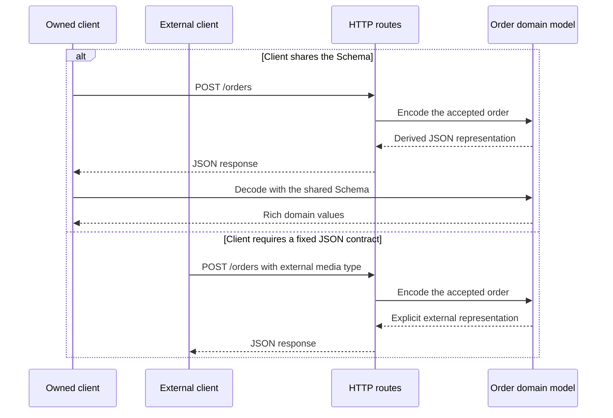

import {
  TutorialCheckpoint,
  EffectStrength,
} from "@astrojs/starlight/components"

<EffectStrength title="One Schema connects domain models and JSON">

Effect Schema can derive a JSON representation from the domain model when the
client shares the same Schema. When an external client imposes a particular
JSON contract, the Schema can describe that representation explicitly without
changing the model used by the application.

</EffectStrength>

## What you will build

The example is a `POST /orders` endpoint that returns an accepted order. The
application works with three values that are more useful than their JSON
counterparts:

- an `OrderId` class prevents an order identifier from becoming an arbitrary
  string;
- a `Date` provides date operations;
- a `ReadonlySet` prevents duplicate labels.

The tutorial sends the same domain model to two kinds of client:

| Client                          | JSON strategy                                       | Result                                                          |
| ------------------------------- | --------------------------------------------------- | --------------------------------------------------------------- |
| A client owned by the same team | Share the Schema and derive the JSON representation | Both sides recover the same rich values                         |
| An external client              | Define its required JSON representation explicitly  | The external contract changes without changing the domain model |

The first round trip begins with the domain value, because only valid domain
values should be sent:

```text title="Shared boundary"
domain model -> encode -> JSON -> decode -> domain model
```

Preserving that round trip is highly desirable. It means the receiving client
recovers the same kind of value that the server encoded, rather than a similar
object assembled by unrelated conversion code.

## Request flow



## Project setup

The project uses three files:

| File        | Role                                                                |
| ----------- | ------------------------------------------------------------------- |
| `order.ts`  | Defines the accepted-order model and returns one predictable order. |
| `server.ts` | Sends the domain model through the HTTP boundary.                   |
| `client.ts` | Represents a client owned by the same team.                         |

Run the server with `--watch`. This option reloads `server.ts` after each saved
edit, so the same process can remain running throughout the tutorial:

```sh title="Watched server"
node --watch server.ts
```

## Derive JSON without duplicating domain models

### 1. Start with ordinary TypeScript

The initial model uses familiar TypeScript and JavaScript types:

```ts title="order.ts"
export class OrderId {
  readonly value: string

  constructor(value: string) {
    this.value = value
  }
}

export interface AcceptedOrder {
  readonly orderId: OrderId
  readonly acceptedAt: Date
  readonly labels: ReadonlySet<string>
  readonly status: "accepted"
}

// This fixture supplies a predictable accepted order for the tutorial.
export const placeOrder = (): AcceptedOrder => ({
  orderId: new OrderId("ord_2026_0001"),
  acceptedAt: new Date("2026-08-09T10:00:00.000Z"),
  labels: new Set(["priority", "b2b"]),
  status: "accepted",
})
```

The first server passes that rich value directly to `JSON.stringify`:

```ts title="server.ts"
import { createServer } from "node:http"
import { placeOrder } from "./order.ts"

const server = createServer((request, response) => {
  const sendJson = (status: number, body: unknown): void => {
    response.writeHead(status, { "content-type": "application/json" })
    response.end(JSON.stringify(body))
  }

  if (request.method !== "POST" || request.url !== "/orders") {
    sendJson(404, { error: "NotFound" })
    return
  }

  sendJson(201, placeOrder())
})

server.listen(3000, () => console.log("Listening on http://localhost:3000"))
```

In a second terminal pane, send a request:

```sh title="Place an order"
curl -i -sS -X POST http://localhost:3000/orders
```

The endpoint returns:

```text title="Expected response"
HTTP/1.1 201 Created
...

{"orderId":{"value":"ord_2026_0001"},"acceptedAt":"2026-08-09T10:00:00.000Z","labels":{},"status":"accepted"}
```

`JSON.stringify` happens to turn the `Date` into a string and exposes the
public field of `OrderId`. It does not know how to represent a `Set`, so
`labels` silently becomes `{}`. Nothing guarantees that a client can turn the
remaining JSON back into an `OrderId`, a `Date`, and a `Set`.

Manual response types and field-by-field conversions could repair this
response, but they would duplicate the domain model and need to stay aligned
with it.

<TutorialCheckpoint number={1} total={4} title="JSON loses part of the model">
  The endpoint returns an empty object for `labels`, and its JSON contains no
  information that tells a client how to reconstruct the rich domain values.
</TutorialCheckpoint>

### 2. Derive the shared JSON representation

The next version describes the domain model with Effect Schema. The same
definitions still produce an `OrderId`, a `Date`, and a `ReadonlySet` for
application code:

```ts title="order.ts"
import { Schema } from "effect"

const OrderIdText = Schema.TemplateLiteral(["ord_", Schema.String])

export class OrderId extends Schema.Class<OrderId>("OrderId")({
  value: OrderIdText,
}) {}

export const AcceptedOrder = Schema.Struct({
  orderId: OrderId,
  acceptedAt: Schema.Date,
  labels: Schema.ReadonlySet(Schema.String),
  status: Schema.Literal("accepted"),
})

export type AcceptedOrder = typeof AcceptedOrder.Type

// Derive the JSON representation that the server and owned client will share.
export const AcceptedOrderJson = Schema.toCodecJson(AcceptedOrder)

export const placeOrder = (): AcceptedOrder => ({
  orderId: new OrderId({ value: "ord_2026_0001" }),
  acceptedAt: new Date("2026-08-09T10:00:00.000Z"),
  labels: new Set(["priority", "b2b"]),
  status: "accepted",
})
```

A Schema is an immutable value that describes the values accepted at runtime
and the values produced after decoding. Defining it does not inspect or convert
anything.

`Schema.TemplateLiteral`
combines fixed and variable string parts. `OrderIdText` accepts strings that
start with `ord_`, while
`Schema.String` describes the
remaining JavaScript string. `Schema.Class`
creates a class that is also a Schema, so decoding constructs an `OrderId`
instance rather than returning a structurally similar object.

`Schema.Struct` combines the field
schemas into one object Schema. `Schema.Date`
describes a valid JavaScript `Date` instance.
`Schema.ReadonlySet` describes
a set whose elements satisfy its inner Schema. `Schema.Literal`
accepts one exact value, so the status can only be `"accepted"`.

`typeof AcceptedOrder.Type` is the TypeScript type of the rich value described
by the Schema. The model and its runtime checks therefore come from the same
definition.

`Schema.toCodecJson` derives
a JSON-compatible codec from that model. A codec describes both directions:
encoding turns an `AcceptedOrder` into JSON-safe data, while decoding rebuilds
an `AcceptedOrder` from that data. For the fields above, it selects an object
for `OrderId`, an ISO string for `Date`, and an array for `ReadonlySet`.

The server now encodes the domain value before passing it to `JSON.stringify`:

```ts title="server.ts" ins={2-5,18-24}
import { createServer } from "node:http"
import { Result, Schema } from "effect"
import { AcceptedOrderJson, placeOrder } from "./order.ts"

const encodeAcceptedOrder = Schema.encodeResult(AcceptedOrderJson)

const server = createServer((request, response) => {
  const sendJson = (status: number, body: unknown): void => {
    response.writeHead(status, { "content-type": "application/json" })
    response.end(JSON.stringify(body))
  }

  if (request.method !== "POST" || request.url !== "/orders") {
    sendJson(404, { error: "NotFound" })
    return
  }

  const encoded = encodeAcceptedOrder(placeOrder())
  if (Result.isFailure(encoded)) {
    sendJson(500, { error: "InvalidOrderResponse" })
    return
  }

  sendJson(201, encoded.success)
})

server.listen(3000, () => console.log("Listening on http://localhost:3000"))
```

`Schema.encodeResult` creates an
encoder for the codec. Calling it returns a `Result`: success contains the
JSON-safe representation, while failure means the application attempted to
send a value that did not satisfy `AcceptedOrder`.
`Result.isFailure` identifies the
failure case. After the early return, TypeScript knows `encoded.success` is
available.

The same request now returns every field in a deliberate representation:

```text title="Expected response"
HTTP/1.1 201 Created
...

{"orderId":{"value":"ord_2026_0001"},"acceptedAt":"2026-08-09T10:00:00.000Z","labels":["priority","b2b"],"status":"accepted"}
```

<TutorialCheckpoint
  number={2}
  total={4}
  title="The Schema produces complete JSON"
>
  Encoding preserves the complete accepted order. The server has no manual
  response type or field-by-field serialization function.
</TutorialCheckpoint>

### 3. Share the Schema with the client

Because the client is owned by the same team, it can import `AcceptedOrderJson`
from the shared `order.ts` module. Its complete implementation is small:

```ts title="client.ts"
import { Result, Schema } from "effect"
import { AcceptedOrderJson, OrderId } from "./order.ts"

const decodeAcceptedOrder = Schema.decodeUnknownResult(AcceptedOrderJson)

const response = await fetch("http://localhost:3000/orders", {
  method: "POST",
})
const decoded = decodeAcceptedOrder(await response.json())

if (Result.isFailure(decoded)) {
  throw decoded.failure
}

const order = decoded.success
console.log({
  orderIdIsOrderId: order.orderId instanceof OrderId,
  acceptedAtIsDate: order.acceptedAt instanceof Date,
  labelsAreSet: order.labels instanceof Set,
})
```

`Schema.decodeUnknownResult`
creates a decoder for untrusted input. The value returned by `response.json()`
is not trusted merely because the server sent it. Calling the decoder checks
the JSON representation and reconstructs the types described by the shared
Schema.

Run the client while the server remains active:

```sh title="Run the owned client"
node client.ts
```

It prints:

```text title="Expected client output"
{
  orderIdIsOrderId: true,
  acceptedAtIsDate: true,
  labelsAreSet: true
}
```

The server and client did not maintain parallel interfaces or mapping
functions. They shared the description of the domain value and derived both
sides of the JSON round trip from it.

<TutorialCheckpoint
  number={3}
  total={4}
  title="The client recovers the rich model"
>
  The owned client decodes the response into an `OrderId`, a `Date`, and a `Set`
  by using the same Schema as the server.
</TutorialCheckpoint>

### 4. Respect an external JSON contract

Sharing a Schema is not always possible. Suppose an external client requires
the same accepted order in this fixed representation:

| Domain field                  | Required external field                             |
| ----------------------------- | --------------------------------------------------- |
| `orderId: OrderId`            | `id: string`                                        |
| `acceptedAt: Date`            | `accepted_at: number` containing epoch milliseconds |
| `labels: ReadonlySet<string>` | `labels: ReadonlyArray<string>`                     |
| `status: "accepted"`          | `state: "ACCEPTED"`                                 |

The domain model should not change to imitate that transport format. Instead,
add an explicit encoding to `order.ts`:

```ts title="order.ts" ins={1,28-57} collapse={3-26}
import { Schema, SchemaTransformation } from "effect"

const OrderIdText = Schema.TemplateLiteral(["ord_", Schema.String])

export class OrderId extends Schema.Class<OrderId>("OrderId")({
  value: OrderIdText,
}) {}

export const AcceptedOrder = Schema.Struct({
  orderId: OrderId,
  acceptedAt: Schema.Date,
  labels: Schema.ReadonlySet(Schema.String),
  status: Schema.Literal("accepted"),
})

export type AcceptedOrder = typeof AcceptedOrder.Type

// Derive the JSON representation that the server and owned client will share.
export const AcceptedOrderJson = Schema.toCodecJson(AcceptedOrder)

export const placeOrder = (): AcceptedOrder => ({
  orderId: new OrderId({ value: "ord_2026_0001" }),
  acceptedAt: new Date("2026-08-09T10:00:00.000Z"),
  labels: new Set(["priority", "b2b"]),
  status: "accepted",
})

const ExternalAcceptedOrderFields = Schema.Struct({
  id: OrderIdText,
  accepted_at: Schema.DateFromMillis,
  labels: Schema.Array(Schema.String),
  state: Schema.Literal("ACCEPTED"),
})

export const ExternalAcceptedOrder = ExternalAcceptedOrderFields.pipe(
  Schema.decodeTo(
    Schema.toType(AcceptedOrder),
    SchemaTransformation.transform({
      decode: ({ id, accepted_at, labels }): AcceptedOrder => ({
        orderId: new OrderId({ value: id }),
        acceptedAt: accepted_at,
        labels: new Set(labels),
        status: "accepted" as const,
      }),
      encode: (order) => ({
        id: order.orderId.value,
        accepted_at: order.acceptedAt,
        labels: Array.from(order.labels),
        state: "ACCEPTED" as const,
      }),
    }),
  ),
)

export const ExternalAcceptedOrderJson = Schema.toCodecJson(
  ExternalAcceptedOrder,
)
```

`ExternalAcceptedOrderFields` describes the external names and formats.
`Schema.DateFromMillis`
decodes epoch milliseconds into a JavaScript `Date` and encodes the `Date` back
into epoch milliseconds. `Schema.Array`
describes the array required for the external `labels` field.

`Schema.decodeTo` connects the
external representation to the domain model. Decoding follows the `decode`
function toward `AcceptedOrder`; encoding follows the `encode` function back
toward `ExternalAcceptedOrderFields`.

The `.pipe(...)` method passes
`ExternalAcceptedOrderFields` into the next function. Reading the code from top
to bottom, `Schema.decodeTo(...)` receives the external fields and returns the
connected Schema. `pipe` only builds that description; it does not encode or
decode an order.

`SchemaTransformation.transform`
supplies those two conversions when neither can fail on its own.
`Schema.toType` exposes only the
domain side of `AcceptedOrder` as the target, because this new connection owns
the external encoding.

The call to `Schema.toCodecJson` is deliberately still present. It makes the
whole representation JSON-compatible, but it respects the explicit encoding
already defined by `Schema.decodeTo`. In particular, it keeps `DateFromMillis`
instead of replacing the required number with the canonical ISO date string.

The server can select the external representation when the request asks for
the external client's media type. The default representation remains unchanged,
so `client.ts` continues to work:

```ts title="server.ts" ins={3-7,10,23-25} collapse={12-21}
import { createServer } from "node:http"
import { Result, Schema } from "effect"
import {
  AcceptedOrderJson,
  ExternalAcceptedOrderJson,
  placeOrder,
} from "./order.ts"

const encodeAcceptedOrder = Schema.encodeResult(AcceptedOrderJson)
const encodeExternalOrder = Schema.encodeResult(ExternalAcceptedOrderJson)

const server = createServer((request, response) => {
  const sendJson = (status: number, body: unknown): void => {
    response.writeHead(status, { "content-type": "application/json" })
    response.end(JSON.stringify(body))
  }

  if (request.method !== "POST" || request.url !== "/orders") {
    sendJson(404, { error: "NotFound" })
    return
  }

  const encoded =
    request.headers.accept === "application/vnd.example.order+json"
      ? encodeExternalOrder(placeOrder())
      : encodeAcceptedOrder(placeOrder())

  if (Result.isFailure(encoded)) {
    sendJson(500, { error: "InvalidOrderResponse" })
    return
  }

  sendJson(201, encoded.success)
})

server.listen(3000, () => console.log("Listening on http://localhost:3000"))
```

Send the request expected by the external client:

```sh title="Request the external representation"
curl -i -sS -X POST http://localhost:3000/orders \
  -H 'accept: application/vnd.example.order+json'
```

The response follows its contract:

```text title="Expected external response"
HTTP/1.1 201 Created
...

{"id":"ord_2026_0001","accepted_at":1786269600000,"labels":["priority","b2b"],"state":"ACCEPTED"}
```

The external field names, numeric timestamp, and uppercase state are explicit
choices at the boundary. `placeOrder` still returns the same `AcceptedOrder`,
and the owned client still receives the canonical representation derived from
the shared Schema.

<TutorialCheckpoint
  number={4}
  total={4}
  title="One model supports both clients"
>
  The shared client reconstructs rich domain values from the derived JSON
  representation. The external client receives its prescribed contract without
  forcing transport details into the domain model.
</TutorialCheckpoint>

## Related tutorials

- [Handle failures without guessing](/docs/v4/tutorials/handle-failures-without-guessing)
- [Keep dependencies explicit without manual wiring](/docs/v4/tutorials/keep-dependencies-explicit-without-manual-wiring)
