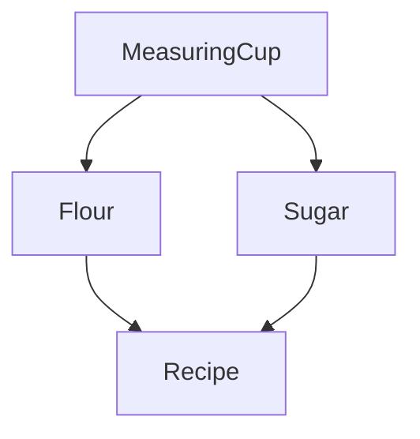

In the [previous section](services), you learned how to create effects which depend on some context to be provided in order to execute, as well as how to provide that context to an Effect.

However, what if we have a service within our effect program that has dependencies on other services in order to be built? We want to **avoid leaking these implementation details** into the service interface.

To represent the "dependency graph" of our program and manage these dependencies more effectively, we can utilize a powerful abstraction called `Layer`.

In this guide, we will cover the following topics:

- Using `Layer`s to control the construction of dependencies.
- Building a dependency graph with `Layer`s.
- Providing a `Layer` to an effect.

## Designing the Dependency Graph

Let's imagine that we want to bake a cake! We could imagine that the dependency graph for an application where we are creating a recipe for a cake might look something like:



From the dependency graph above, we can observe the following:

- Both the `Flour` and `Sugar` services depend on the `MeasuringCup` service.
- The `Recipe` service depends on its ingredients, which in this case are `Flour` and `Sugar`.

Our goal is to build the `Recipe` service along with its direct and indirect dependencies. This means we need to ensure that the `MeasuringCup` service is available for both `Flour` and `Sugar`, and then provide the ingredients to the `Recipe` service.

Now let's take our dependency graph and translate it into code.

## Creating Layers

We will use `Layer`s to construct the `Recipe` service instead of providing a service implementation directly as we did in the [Managing Services](services) guide.
Layers are a way of separating implementation details from the service itself.

<Idea>
  When a service has its own dependencies, it's best to separate
  implementation details into layers. Layers act as **constructors** for
  creating the service, allowing us to handle dependencies at the construction
  level rather than the service level.
</Idea>

A `Layer<RIn, E, ROut>` represents a blueprint for constructing a `Context<ROut>`. It takes a value of type `RIn` as input and may potentially produce an error of type `E` during the construction process.

In our case, the `ROut` type represents the service we want to construct, while `RIn` represents the dependencies required for construction.

<Info>
  For simplicity, let's assume that we won't encounter any errors during the
  value construction (meaning `E = never`).
</Info>

Now, let's determine how many layers we need to implement our dependency graph:

| **Layer**          | **Dependencies**                                                  | **Type**                               |
| ------------------ | ----------------------------------------------------------------- | -------------------------------------- |
| `MeasuringCupLive` | The `MeasuringCup` service does not depend on any other services  | `Layer<never, never, MeasuringCup>`    |
| `SugarLive`        | The `Sugar` service depends on the `MeasuringCup` service         | `Layer<MeasuringCup, never, Sugar>`    |
| `FlourLive`        | The `Flour` service depends on the `MeasuringCup` service         | `Layer<MeasuringCup, never, Flour>`    |
| `RecipeLive`       | The `Recipe` service depends on both `Flour` and `Sugar` services | `Layer<Flour \| Sugar, never, Recipe>` |

<Idea>
  A common convention when naming the `Layer` for a particular service is to
  add a `Live` suffix for the "live" implementation and a `Test` suffix for
  the "test" implementation. For example, for a `Database` service, the
  `DatabaseLive` would be the layer you provide in your application and the
  `DatabaseTest` would be the layer you provide in your tests.
</Idea>

When a service has multiple dependencies, they are represented as a **union type**. In our case, the `Recipe` service depends on both the `Flour` and `Sugar` services.
Therefore, the type for the `RecipeLive` layer will be:

```ts
Layer<Flour | Sugar, never, Recipe>
```

### MeasuringCup

The `MeasuringCup` service does not depend on any other services, so `MeasuringCupLive` will be the simplest layer to implement.
Just like in the [Managing Services](services) guide, we must create a `Tag` for the service.
And because the service has no dependencies, we can create the layer directly using `Layer.succeed(tag, service){:ts}`:

```ts twoslash
import { Effect, Context, Layer } from "effect"

// Define the interface for the MeasuringCup service
interface MeasuringCup {
  readonly measure: (
    amount: number,
    unit: string
  ) => Effect.Effect<never, never, string>
}

// Create a tag for the MeasuringCup service
const MeasuringCup = Context.Tag<MeasuringCup>()

const MeasuringCupLive = Layer.succeed(MeasuringCup, {
  measure: (amount, unit) => Effect.succeed(`Measured ${amount} ${unit}(s)`)
})
```

Looking at the type of `MeasuringCupLive` we can observe:

- `RIn` is `never`, indicating that the layer has no dependencies
- `E` is `never`, indicating that layer construction cannot fail
- `ROut` is `MeasuringCup`, indicating that constructing the layer will produce a `MeasuringCup` service

Note that, to construct `MeasuringCupLive`, we used the `MeasuringCup.of`
constructor. However, this is merely a helper to ensure correct type inference
for the implementation. It's possible to skip this helper and construct the
implementation directly as a simple object:

```ts
const MeasuringCupLive = Layer.succeed(MeasuringCup, {
  measure: (amount, unit) => Effect.succeed(`Measured ${amount} ${unit}(s)`)
})
```

### Sugar & Flour

Now we can move on to the implementation of the `Sugar` and `Flour` services, both of which depend on the `MeasuringCup` service to measure the proper amount of the ingredient.

Just like we did in the [Services](services#using-the-service) guide, we can map over the `MeasuringCup` Tag to "extract" the service from the context and make use of it within our ingredient services.

Given that mapping over a Tag is an effectful operation, we use `Layer.effect(tag, effect){:ts}` to create a `Layer` from the resulting `Effect`.

```ts twoslash
import { Effect, Context, Layer } from "effect"

interface MeasuringCup {
  readonly measure: (
    amount: number,
    unit: string
  ) => Effect.Effect<never, never, string>
}

const MeasuringCup = Context.Tag<MeasuringCup>()

const MeasuringCupLive = Layer.succeed(MeasuringCup, {
  measure: (amount, unit) => Effect.succeed(`Measured ${amount} ${unit}(s)`)
})

// ---cut---
interface Sugar {
  readonly grams: (amount: number) => Effect.Effect<never, never, string>
}

const Sugar = Context.Tag<Sugar>()

const SugarLive = Layer.effect(
  Sugar,
  Effect.map(MeasuringCup, (measuringCup) => ({
    grams: (amount) => measuringCup.measure(amount, "gram")
  }))
)

interface Flour {
  readonly cups: (amount: number) => Effect.Effect<never, never, string>
}

const Flour = Context.Tag<Flour>()

const FlourLive = Layer.effect(
  Flour,
  Effect.map(MeasuringCup, (measuringCup) => ({
    cups: (amount) => measuringCup.measure(amount, "cup")
  }))
)
```

Looking at the type of `SugarLive` and `FlourLive` we can observe:

- `RIn` is `MeasuringCup`, indicating that the layer has a dependency
- `E` is `never`, indicating that layer construction cannot fail
- `ROut` is our ingredient

### Recipe

Finally, we can use our ingredients to assemble the final recipe:

<Tabs items={["Using Effect.gen", "Using pipe"]}>
<Tab>

```ts twoslash
import { Effect, Context, Layer } from "effect"

interface MeasuringCup {
  readonly measure: (
    amount: number,
    unit: string
  ) => Effect.Effect<never, never, string>
}

const MeasuringCup = Context.Tag<MeasuringCup>()

const MeasuringCupLive = Layer.succeed(MeasuringCup, {
  measure: (amount, unit) => Effect.succeed(`Measured ${amount} ${unit}(s)`)
})

interface Sugar {
  readonly grams: (amount: number) => Effect.Effect<never, never, string>
}

const Sugar = Context.Tag<Sugar>()

const SugarLive = Layer.effect(
  Sugar,
  Effect.map(MeasuringCup, (measuringCup) => ({
    grams: (amount) => measuringCup.measure(amount, "gram")
  }))
)

interface Flour {
  readonly cups: (amount: number) => Effect.Effect<never, never, string>
}

const Flour = Context.Tag<Flour>()

const FlourLive = Layer.effect(
  Flour,
  Effect.map(MeasuringCup, (measuringCup) => ({
    cups: (amount) => measuringCup.measure(amount, "cup")
  }))
)

// ---cut---
interface Recipe {
  readonly steps: Effect.Effect<never, never, ReadonlyArray<string>>
}

const Recipe = Context.Tag<Recipe>()

const RecipeLive = Layer.effect(
  Recipe,
  Effect.gen(function* (_) {
    const sugar = yield* _(Sugar)
    const flour = yield* _(Flour)
    return {
      steps: Effect.all([sugar.grams(200), flour.cups(1)])
    }
  })
)
```

</Tab>
<Tab>

```ts twoslash
import { Effect, Context, Layer } from "effect"

interface MeasuringCup {
  readonly measure: (
    amount: number,
    unit: string
  ) => Effect.Effect<never, never, string>
}

const MeasuringCup = Context.Tag<MeasuringCup>()

const MeasuringCupLive = Layer.succeed(MeasuringCup, {
  measure: (amount, unit) => Effect.succeed(`Measured ${amount} ${unit}(s)`)
})

interface Sugar {
  readonly grams: (amount: number) => Effect.Effect<never, never, string>
}

const Sugar = Context.Tag<Sugar>()

const SugarLive = Layer.effect(
  Sugar,
  Effect.map(MeasuringCup, (measuringCup) => ({
    grams: (amount) => measuringCup.measure(amount, "gram")
  }))
)

interface Flour {
  readonly cups: (amount: number) => Effect.Effect<never, never, string>
}

const Flour = Context.Tag<Flour>()

const FlourLive = Layer.effect(
  Flour,
  Effect.map(MeasuringCup, (measuringCup) => ({
    cups: (amount) => measuringCup.measure(amount, "cup")
  }))
)

// ---cut---
interface Recipe {
  readonly steps: Effect.Effect<never, never, ReadonlyArray<string>>
}

const Recipe = Context.Tag<Recipe>()

const RecipeLive = Layer.effect(
  Recipe,
  Effect.all([Sugar, Flour]).pipe(
    Effect.map(([sugar, flour]) => ({
      steps: Effect.all([sugar.grams(200), flour.cups(1)])
    }))
  )
)
```

</Tab>
</Tabs>

Looking at the type of `RecipeLive` we can observe that the `RIn` type is `Flour | Sugar`, i.e. the `Recipe` service requires both `Flour` and `Sugar` services.

## Combining Layers

Layers can be combined in two primary ways: merging and composing.

### Merging

Layers can be combined through merging using the `Layer.merge` combinator:

```ts
Layer.merge(layer1, layer2)
```

When we merge two layers, the resulting layer:

- requires all the services that both of them require.
- produces all services that both of them produce.

Merging is useful when we combine layers that don't have any relationship with each other.

For example, in our cake recipe application above, we can merge our `FlourLive` and `SugarLive` layers
into a single `IngredientsLive` layer, which retains the requirements of both layers (`MeasuringCup`) and the outputs of both layers (`Flour | Sugar`):

```ts twoslash
import { Effect, Context, Layer } from "effect"

interface MeasuringCup {
  readonly measure: (
    amount: number,
    unit: string
  ) => Effect.Effect<never, never, string>
}

const MeasuringCup = Context.Tag<MeasuringCup>()

const MeasuringCupLive = Layer.succeed(MeasuringCup, {
  measure: (amount, unit) => Effect.succeed(`Measured ${amount} ${unit}(s)`)
})

interface Sugar {
  readonly grams: (amount: number) => Effect.Effect<never, never, string>
}

const Sugar = Context.Tag<Sugar>()

const SugarLive = Layer.effect(
  Sugar,
  Effect.map(MeasuringCup, (measuringCup) => ({
    grams: (amount) => measuringCup.measure(amount, "gram")
  }))
)

interface Flour {
  readonly cups: (amount: number) => Effect.Effect<never, never, string>
}

const Flour = Context.Tag<Flour>()

const FlourLive = Layer.effect(
  Flour,
  Effect.map(MeasuringCup, (measuringCup) => ({
    cups: (amount) => measuringCup.measure(amount, "cup")
  }))
)

// ---cut---
const IngredientsLive = Layer.merge(FlourLive, SugarLive)
```

### Composing

Layers can be composed using the `Layer.provide` combinator:

```ts
first.pipe(Layer.provide(second))
```

Sequential composition of layers implies that the output of one layer (`first`) is used as input for the subsequent layer (`second`),
resulting in one layer with the requirement of the first, and the output of the second.

Now we can compose the `MeasuringCupLive` layer with the `IngredientsLive` layer, and then compose the result with the `RecipeLive` layer:

```ts twoslash
import { Effect, Context, Layer } from "effect"

interface MeasuringCup {
  readonly measure: (
    amount: number,
    unit: string
  ) => Effect.Effect<never, never, string>
}

const MeasuringCup = Context.Tag<MeasuringCup>()

const MeasuringCupLive = Layer.succeed(MeasuringCup, {
  measure: (amount, unit) => Effect.succeed(`Measured ${amount} ${unit}(s)`)
})

interface Sugar {
  readonly grams: (amount: number) => Effect.Effect<never, never, string>
}

const Sugar = Context.Tag<Sugar>()

const SugarLive = Layer.effect(
  Sugar,
  Effect.map(MeasuringCup, (measuringCup) => ({
    grams: (amount) => measuringCup.measure(amount, "gram")
  }))
)

interface Flour {
  readonly cups: (amount: number) => Effect.Effect<never, never, string>
}

const Flour = Context.Tag<Flour>()

const FlourLive = Layer.effect(
  Flour,
  Effect.map(MeasuringCup, (measuringCup) => ({
    cups: (amount) => measuringCup.measure(amount, "cup")
  }))
)

interface Recipe {
  readonly steps: Effect.Effect<never, never, ReadonlyArray<string>>
}

const Recipe = Context.Tag<Recipe>()

const RecipeLive = Layer.effect(
  Recipe,
  Effect.gen(function* (_) {
    const sugar = yield* _(Sugar)
    const flour = yield* _(Flour)
    return {
      steps: Effect.all([sugar.grams(200), flour.cups(1)])
    }
  })
)

// ---cut---
const IngredientsLive = Layer.merge(FlourLive, SugarLive)

const MainLive = RecipeLive.pipe(
  Layer.provide(IngredientsLive), // provides the ingredients to the recipe
  Layer.provide(MeasuringCupLive) // provides the MeasuringCup to the ingredients
)
```

### Merging and Composing

Let's say we want our `MainLive` layer to return both the `MeasuringCup` and `Recipe` services.
We can achieve this with `Layer.provideMerge`:

```ts twoslash
import { Effect, Context, Layer } from "effect"

interface MeasuringCup {
  readonly measure: (
    amount: number,
    unit: string
  ) => Effect.Effect<never, never, string>
}

const MeasuringCup = Context.Tag<MeasuringCup>()

const MeasuringCupLive = Layer.succeed(MeasuringCup, {
  measure: (amount, unit) => Effect.succeed(`Measured ${amount} ${unit}(s)`)
})

interface Sugar {
  readonly grams: (amount: number) => Effect.Effect<never, never, string>
}

const Sugar = Context.Tag<Sugar>()

const SugarLive = Layer.effect(
  Sugar,
  Effect.map(MeasuringCup, (measuringCup) => ({
    grams: (amount) => measuringCup.measure(amount, "gram")
  }))
)

interface Flour {
  readonly cups: (amount: number) => Effect.Effect<never, never, string>
}

const Flour = Context.Tag<Flour>()

const FlourLive = Layer.effect(
  Flour,
  Effect.map(MeasuringCup, (measuringCup) => ({
    cups: (amount) => measuringCup.measure(amount, "cup")
  }))
)

interface Recipe {
  readonly steps: Effect.Effect<never, never, ReadonlyArray<string>>
}

const Recipe = Context.Tag<Recipe>()

const RecipeLive = Layer.effect(
  Recipe,
  Effect.gen(function* (_) {
    const sugar = yield* _(Sugar)
    const flour = yield* _(Flour)
    return {
      steps: Effect.all([sugar.grams(200), flour.cups(1)])
    }
  })
)

// ---cut---
const IngredientsLive = Layer.merge(FlourLive, SugarLive)

const MainLive = RecipeLive.pipe(
  Layer.provide(IngredientsLive),
  Layer.provideMerge(MeasuringCupLive)
)
```

## Providing a Layer to an Effect

Now that we have assembled the fully resolved `MainLive` for our application,
we can provide it to our program to satisfy the program's requirements using `Effect.provide(effect, layer){:ts}`:

<Tabs items={["Using Effect.gen", "Using pipe"]}>
<Tab>

```ts twoslash
import { Effect, Context, Layer } from "effect"

interface MeasuringCup {
  readonly measure: (
    amount: number,
    unit: string
  ) => Effect.Effect<never, never, string>
}

const MeasuringCup = Context.Tag<MeasuringCup>()

const MeasuringCupLive = Layer.succeed(MeasuringCup, {
  measure: (amount, unit) => Effect.succeed(`Measured ${amount} ${unit}(s)`)
})

interface Sugar {
  readonly grams: (amount: number) => Effect.Effect<never, never, string>
}

const Sugar = Context.Tag<Sugar>()

const SugarLive = Layer.effect(
  Sugar,
  Effect.map(MeasuringCup, (measuringCup) => ({
    grams: (amount) => measuringCup.measure(amount, "gram")
  }))
)

interface Flour {
  readonly cups: (amount: number) => Effect.Effect<never, never, string>
}

const Flour = Context.Tag<Flour>()

const FlourLive = Layer.effect(
  Flour,
  Effect.map(MeasuringCup, (measuringCup) => ({
    cups: (amount) => measuringCup.measure(amount, "cup")
  }))
)

interface Recipe {
  readonly steps: Effect.Effect<never, never, ReadonlyArray<string>>
}

const Recipe = Context.Tag<Recipe>()

const RecipeLive = Layer.effect(
  Recipe,
  Effect.gen(function* (_) {
    const sugar = yield* _(Sugar)
    const flour = yield* _(Flour)
    return {
      steps: Effect.all([sugar.grams(200), flour.cups(1)])
    }
  })
)

const IngredientsLive = Layer.merge(FlourLive, SugarLive)

const MainLive = RecipeLive.pipe(
  Layer.provide(IngredientsLive),
  Layer.provide(MeasuringCupLive)
)

// ---cut---
import { Console } from "effect"

const program = Effect.gen(function* (_) {
  const recipe = yield* _(Recipe)
  const steps = yield* _(recipe.steps)
  return yield* _(
    Effect.forEach(steps, (step) => Console.log(step), {
      concurrency: "unbounded",
      discard: true
    })
  )
})

const runnable = Effect.provide(program, MainLive)

Effect.runPromise(runnable)
/*
Output:
Measured 200 gram(s)
Measured 1 cup(s)
*/
```

</Tab>
<Tab>

```ts twoslash
import { Effect, Context, Layer } from "effect"

interface MeasuringCup {
  readonly measure: (
    amount: number,
    unit: string
  ) => Effect.Effect<never, never, string>
}

const MeasuringCup = Context.Tag<MeasuringCup>()

const MeasuringCupLive = Layer.succeed(MeasuringCup, {
  measure: (amount, unit) => Effect.succeed(`Measured ${amount} ${unit}(s)`)
})

interface Sugar {
  readonly grams: (amount: number) => Effect.Effect<never, never, string>
}

const Sugar = Context.Tag<Sugar>()

const SugarLive = Layer.effect(
  Sugar,
  Effect.map(MeasuringCup, (measuringCup) => ({
    grams: (amount) => measuringCup.measure(amount, "gram")
  }))
)

interface Flour {
  readonly cups: (amount: number) => Effect.Effect<never, never, string>
}

const Flour = Context.Tag<Flour>()

const FlourLive = Layer.effect(
  Flour,
  Effect.map(MeasuringCup, (measuringCup) => ({
    cups: (amount) => measuringCup.measure(amount, "cup")
  }))
)

interface Recipe {
  readonly steps: Effect.Effect<never, never, ReadonlyArray<string>>
}

const Recipe = Context.Tag<Recipe>()

const RecipeLive = Layer.effect(
  Recipe,
  Effect.gen(function* (_) {
    const sugar = yield* _(Sugar)
    const flour = yield* _(Flour)
    return {
      steps: Effect.all([sugar.grams(200), flour.cups(1)])
    }
  })
)

const IngredientsLive = Layer.merge(FlourLive, SugarLive)

const MainLive = RecipeLive.pipe(
  Layer.provide(IngredientsLive),
  Layer.provide(MeasuringCupLive)
)

// ---cut---
import { Console } from "effect"

const program = Recipe.pipe(
  Effect.flatMap((recipe) => recipe.steps),
  Effect.flatMap((steps) =>
    Effect.forEach(steps, (step) => Console.log(step), {
      concurrency: "unbounded",
      discard: true
    })
  )
)

const runnable = Effect.provide(program, MainLive)

Effect.runPromise(runnable)
/*
Output:
Measured 200 gram(s)
Measured 1 cup(s)
*/
```

</Tab>
</Tabs>

The `Effect.forEach` function is used to iterate over a collection of values (`steps`) and perform a side effect on each element (`Console.log`), discarding the result (`void`).
