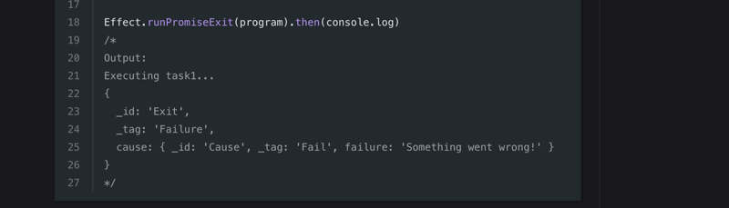

We are very excited to unveil the newly rebuilt Effect website - a major step
forward in both functionality and performance! This update represents an
exciting milestone as we transition to using Astro, a change that will allow us
to deliver a better experience to our growing community of developers.

### Why the Switch to Astro?

Over the past year, the Effect website has grown significantly, becoming the
go-to source for everything Effect — from in-depth documentation to key
announcements and beyond. This growth has been invaluable to the community,
providing a wealth of resources on Effect. However, as the site expanded,
maintaining and updating the site's content has become one of our biggest
challenges.

Our previous content management solution relied on a patchwork mixture of
disparate tooling, resulting in progressively slower build times as our content
grew. The inability of our system to scale with our content became especially
problematic as we began to consider adding more use-case driven examples and
interactive tutorials to the site.

Switching to Astro has provided us with a unified, streamlined set of tools that
has dramatically improved our workflow. Astro’s optimized approach to content
management allows us to iterate, build, and deploy faster, supporting our
commitment to creating an accessible, responsive, and continually evolving hub
for Effect’s developer community.

### What's New

The newly rebuilt Effect website comes with several enhancements to improve the
developer experience:

- **Better Support for Shiki Twoslash in Code Snippets**

  High-quality code snippets are essential in any technical documentation, and
  with enhanced support for Shiki Twoslash, we’re making our code examples more
  interactive and informative. Shiki Twoslash provides detailed, in-line type
  information and error hints directly within the snippets, helping developers
  grasp concepts faster.

  

- **Improved Site-Wide Search**

  Our new and improved search functionality enables you to find relevant content
  quickly and effortlessly. Whether you’re looking for specific functions, blog
  posts, or other content, you’ll now enjoy a faster, more intuitive search
  experience across the site.

- **RSS Support for the Blog**

  Stay updated on all things Effect with RSS support! Now you can follow our
  latest posts, announcements, and tutorials directly from your RSS feed.

- **Faster Load Time for the Effect Playground**

  The Effect Playground is an invaluable tool experimenting with the library,
  and now it’s even faster! You’ll experience reduced load times, so you'll do
  less waiting and more coding.

...and many improvements that we don't have room to list here!

### What’s Next?

This release is just the beginning. The Effect team is actively working on new,
use-case-driven documentation as well as hands-on tutorials to accelerate your
onboarding experience.

Our goal is to make the Effect ecosystem as approachable as possible, empowering
developers at all levels to quickly gain proficiency and confidence.

We hope you enjoy the new Effect website! Dive in, explore the features, and let
us know what you think. Your feedback is invaluable in helping us shape the
future of Effect.

_The Effect Team_
