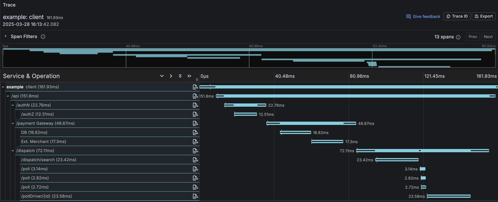

import { Tabs, TabItem, Steps } from "@astrojs/starlight/components"

Although logs and metrics are useful to understand the behavior of individual services, they are not enough to provide a complete overview of the lifetime of a request in a distributed system.

In a distributed system, a request can span multiple services and each service can make multiple requests to other services to fulfill the request. In such a scenario, we need to have a way to track the lifetime of a request across multiple services to diagnose what services are the bottlenecks and where the request is spending most of its time.

## Spans

A **span** represents a single unit of work or operation within a request. It provides a detailed view of what happened during the execution of that specific operation.

Each span typically contains the following information:

| Span Component   | Description                                                        |
| ---------------- | ------------------------------------------------------------------ |
| **Name**         | Describes the specific operation being tracked.                    |
| **Timing Data**  | Timestamps indicating when the operation started and its duration. |
| **Log Messages** | Structured logs capturing important events during the operation.   |
| **Attributes**   | Metadata providing additional context about the operation.         |

Spans are key building blocks in tracing, helping you visualize and understand the flow of requests through various services.

## Traces

A trace records the paths taken by requests (made by an application or end-user) as they propagate through multi-service architectures, like microservice and serverless applications.

Without tracing, it is challenging to pinpoint the cause of performance problems in a distributed system.

A trace is made of one or more spans. The first span represents the root span. Each root span represents a request from start to finish. The spans underneath the parent provide a more in-depth context of what occurs during a request (or what steps make up a request).

Many Observability back-ends visualize traces as waterfall diagrams that may look something like this:


Waterfall diagrams show the parent-child relationship between a root span and its child spans. When a span encapsulates another span, this also represents a nested relationship.

## Creating Spans

You can add tracing to an effect by creating a span using the `Effect.withSpan` API. This helps you track specific operations within the effect.

**Example** (Adding a Span to an Effect)

```ts twoslash
import { Effect } from "effect"

// Define an effect that delays for 100 milliseconds
const program = Effect.void.pipe(Effect.delay("100 millis"))

// Instrument the effect with a span for tracing
const instrumented = program.pipe(Effect.withSpan("myspan"))
```

Instrumenting an effect with a span does not change its type. If you start with an `Effect<A, E, R>`, the result remains an `Effect<A, E, R>`.

## Printing Spans

To print spans for debugging or analysis, you'll need to install the required tracing tools. Here’s how to set them up for your project.

### Installing Dependencies

Choose your package manager and install the necessary libraries:

   <Tabs syncKey="package-manager">

   <TabItem label="npm" icon="seti:npm">

```sh showLineNumbers=false
npm install @effect/opentelemetry
npm install @opentelemetry/sdk-trace-base
# For NodeJS applications
npm install @opentelemetry/sdk-trace-node
# For browser applications
npm install @opentelemetry/sdk-trace-web
# If you also need to export metrics
npm install @opentelemetry/sdk-metrics
```

   </TabItem>

   <TabItem label="pnpm" icon="pnpm">

```sh showLineNumbers=false
pnpm add @effect/opentelemetry
pnpm add @opentelemetry/sdk-trace-base
# For NodeJS applications
pnpm add @opentelemetry/sdk-trace-node
# For browser applications
pnpm add @opentelemetry/sdk-trace-web
# If you also need to export metrics
pnpm add @opentelemetry/sdk-metrics
```

   </TabItem>

   <TabItem label="Yarn" icon="seti:yarn">

```sh showLineNumbers=false
yarn add @effect/opentelemetry
yarn add @opentelemetry/sdk-trace-base
# For NodeJS applications
yarn add @opentelemetry/sdk-trace-node
# For browser applications
yarn add @opentelemetry/sdk-trace-web
# If you also need to export metrics
yarn add @opentelemetry/sdk-metrics
```

   </TabItem>

   <TabItem label="Bun" icon="bun">

```sh showLineNumbers=false
bun add @effect/opentelemetry
bun add @opentelemetry/sdk-trace-base
# For NodeJS applications
bun add @opentelemetry/sdk-trace-node
# For browser applications
bun add @opentelemetry/sdk-trace-web
# If you also need to export metrics
bun add @opentelemetry/sdk-metrics
```

   </TabItem>

   </Tabs>

### Printing a Span to the Console

Once the dependencies are installed, you can set up span printing using OpenTelemetry. Here's an example showing how to print a span for an effect.

**Example** (Setting Up and Printing a Span)

```ts twoslash
import { Effect } from "effect"
import { NodeSdk } from "@effect/opentelemetry"
import {
  ConsoleSpanExporter,
  BatchSpanProcessor
} from "@opentelemetry/sdk-trace-base"

// Define an effect that delays for 100 milliseconds
const program = Effect.void.pipe(Effect.delay("100 millis"))

// Instrument the effect with a span for tracing
const instrumented = program.pipe(Effect.withSpan("myspan"))

// Set up tracing with the OpenTelemetry SDK
const NodeSdkLive = NodeSdk.layer(() => ({
  resource: { serviceName: "example" },
  // Export span data to the console
  spanProcessor: new BatchSpanProcessor(new ConsoleSpanExporter())
}))

// Run the effect, providing the tracing layer
Effect.runPromise(instrumented.pipe(Effect.provide(NodeSdkLive)))
/*
Example Output:
{
  traceId: 'd0f730abfc366205806469596092b239',
  parentId: undefined,
  traceState: undefined,
  name: 'myspan',
  id: 'ab4e42592e7f1f7c',
  kind: 0,
  timestamp: 1697040012664380.5,
  duration: 2895.769,
  attributes: {},
  status: { code: 1 },
  events: [],
  links: []
}
*/
```

### Understanding the Span Output

The output provides detailed information about the span:

| Field        | Description                                                                                                                                                                                                    |
| ------------ | -------------------------------------------------------------------------------------------------------------------------------------------------------------------------------------------------------------- |
| `traceId`    | A unique identifier for the entire trace, helping trace requests or operations as they move through an application.                                                                                            |
| `parentId`   | Identifies the parent span of the current span, marked as `undefined` in the output when there is no parent span, making it a root span.                                                                       |
| `name`       | Describes the name of the span, indicating the operation being tracked (e.g., "myspan").                                                                                                                       |
| `id`         | A unique identifier for the current span, distinguishing it from other spans within a trace.                                                                                                                   |
| `timestamp`  | A timestamp representing when the span started, measured in microseconds since the Unix epoch.                                                                                                                 |
| `duration`   | Specifies the duration of the span, representing the time taken to complete the operation (e.g., `2895.769` microseconds).                                                                                     |
| `attributes` | Spans may contain attributes, which are key-value pairs providing additional context or information about the operation. In this output, it's an empty object, indicating no specific attributes in this span. |
| `status`     | The status field provides information about the span's status. In this case, it has a code of 1, which typically indicates an OK status (whereas a code of 2 signifies an ERROR status)                        |
| `events`     | Spans can include events, which are records of specific moments during the span's lifecycle. In this output, it's an empty array, suggesting no specific events recorded.                                      |
| `links`      | Links can be used to associate this span with other spans in different traces. In the output, it's an empty array, indicating no specific links for this span.                                                 |

### Span Capturing an Error

Here's how a span looks when the effect encounters an error:

**Example** (Span for an Effect that Fails)

```ts twoslash "code: 2"
import { Effect } from "effect"
import { NodeSdk } from "@effect/opentelemetry"
import {
  ConsoleSpanExporter,
  BatchSpanProcessor
} from "@opentelemetry/sdk-trace-base"

const program = Effect.fail("Oh no!").pipe(
  Effect.delay("100 millis"),
  Effect.withSpan("myspan")
)

const NodeSdkLive = NodeSdk.layer(() => ({
  resource: { serviceName: "example" },
  spanProcessor: new BatchSpanProcessor(new ConsoleSpanExporter())
}))

Effect.runPromiseExit(program.pipe(Effect.provide(NodeSdkLive))).then(
  console.log
)
/*
Example Output:
{
  traceId: '760510a3f9a0881a09de990c87ec1cef',
  parentId: undefined,
  traceState: undefined,
  name: 'myspan',
  id: 'a528e38e82e848a5',
  kind: 0,
  timestamp: 1697091363002970.5,
  duration: 110371.664,
  attributes: {},
  status: { code: 2, message: 'Error: Oh no!' },
  events: [],
  links: []
}
{
  _id: 'Exit',
  _tag: 'Failure',
  cause: { _id: 'Cause', _tag: 'Fail', failure: 'Oh no!' }
}
*/
```

In this example, the span's status code is `2`, indicating an error. The message in the status provides more details about the failure.

## Adding Annotations

You can provide extra information to a span by utilizing the `Effect.annotateCurrentSpan` function.
This function allows you to attach key-value pairs, offering more context about the execution of the span.

**Example** (Annotating a Span)

```ts twoslash "attributes: { key: 'value' }"
import { Effect } from "effect"
import { NodeSdk } from "@effect/opentelemetry"
import {
  ConsoleSpanExporter,
  BatchSpanProcessor
} from "@opentelemetry/sdk-trace-base"

const program = Effect.void.pipe(
  Effect.delay("100 millis"),
  // Annotate the span with a key-value pair
  Effect.tap(() => Effect.annotateCurrentSpan("key", "value")),
  // Wrap the effect in a span named 'myspan'
  Effect.withSpan("myspan")
)

// Set up tracing with the OpenTelemetry SDK
const NodeSdkLive = NodeSdk.layer(() => ({
  resource: { serviceName: "example" },
  spanProcessor: new BatchSpanProcessor(new ConsoleSpanExporter())
}))

// Run the effect, providing the tracing layer
Effect.runPromise(program.pipe(Effect.provide(NodeSdkLive)))
/*
Example Output:
{
  traceId: '869c9d74d9db14a4ba4393ca8e0f61db',
  parentId: undefined,
  traceState: undefined,
  name: 'myspan',
  id: '31eb49570d197f8d',
  kind: 0,
  timestamp: 1697045981663321.5,
  duration: 109563.353,
  attributes: { key: 'value' },
  status: { code: 1 },
  events: [],
  links: []
}
*/
```

## Logs as events

In the context of tracing, logs are converted into "Span Events." These events offer structured insights into your application's activities and provide a timeline of when specific operations occurred.

```ts twoslash
import { Effect } from "effect"
import { NodeSdk } from "@effect/opentelemetry"
import {
  ConsoleSpanExporter,
  BatchSpanProcessor
} from "@opentelemetry/sdk-trace-base"

// Define a program that logs a message and delays for 100 milliseconds
const program = Effect.log("Hello").pipe(
  Effect.delay("100 millis"),
  Effect.withSpan("myspan")
)

// Set up tracing with the OpenTelemetry SDK
const NodeSdkLive = NodeSdk.layer(() => ({
  resource: { serviceName: "example" },
  spanProcessor: new BatchSpanProcessor(new ConsoleSpanExporter())
}))

// Run the effect, providing the tracing layer
Effect.runPromise(program.pipe(Effect.provide(NodeSdkLive)))
/*
Example Output:
{
  traceId: 'ad708d58c15f9e5c7b5cca2eeb6838a2',
  parentId: undefined,
  traceState: undefined,
  name: 'myspan',
  id: '4353fd47423e786a',
  kind: 0,
  timestamp: 1697043230170724.2,
  duration: 112052.514,
  attributes: {},
  status: { code: 1 },
  events: [
    {
      name: 'Hello',
      attributes: { 'effect.fiberId': '#0', 'effect.logLevel': 'INFO' }, // Log attributes
      time: [ 1697043230, 280923805 ], // Event timestamp
      droppedAttributesCount: 0
    }
  ],
  links: []
}
*/
```

Each span can include events, which capture specific moments during the execution of a span. In this example, a log message `"Hello"` is recorded as an event within the span. Key details of the event include:

| Field                    | Description                                                                                       |
| ------------------------ | ------------------------------------------------------------------------------------------------- |
| `name`                   | The name of the event, which corresponds to the logged message (e.g., `'Hello'`).                 |
| `attributes`             | Key-value pairs that provide additional context about the event, such as `fiberId` and log level. |
| `time`                   | The timestamp of when the event occurred, shown in a high-precision format.                       |
| `droppedAttributesCount` | Indicates how many attributes were discarded, if any. In this case, no attributes were dropped.   |

## Nesting Spans

Spans can be nested to represent a hierarchy of operations. This allows you to track how different parts of your application relate to one another during execution. The following example demonstrates how to create and manage nested spans.

**Example** (Nesting Spans in a Trace)

```ts twoslash "b953d6c7d37ad93d"
import { Effect } from "effect"
import { NodeSdk } from "@effect/opentelemetry"
import {
  ConsoleSpanExporter,
  BatchSpanProcessor
} from "@opentelemetry/sdk-trace-base"

const child = Effect.void.pipe(
  Effect.delay("100 millis"),
  Effect.withSpan("child")
)

const parent = Effect.gen(function* () {
  yield* Effect.sleep("20 millis")
  yield* child
  yield* Effect.sleep("10 millis")
}).pipe(Effect.withSpan("parent"))

// Set up tracing with the OpenTelemetry SDK
const NodeSdkLive = NodeSdk.layer(() => ({
  resource: { serviceName: "example" },
  spanProcessor: new BatchSpanProcessor(new ConsoleSpanExporter())
}))

// Run the effect, providing the tracing layer
Effect.runPromise(parent.pipe(Effect.provide(NodeSdkLive)))
/*
Example Output:
{
  traceId: '92fe81f1454d9c099198568cf867dc59',
  parentId: 'b953d6c7d37ad93d', // This indicates the span is a child of 'parent'
  traceState: undefined,
  name: 'child',
  id: '2fd19c8c23ebc7e8', // Unique ID for the child span
  kind: 0,
  timestamp: 1697043815321888.2,
  duration: 106536.264,
  attributes: {},
  status: { code: 1 },
  events: [],
  links: []
}
{
  traceId: '92fe81f1454d9c099198568cf867dc59',
  parentId: undefined, // Indicates this is the root span
  traceState: undefined,
  name: 'parent',
  id: 'b953d6c7d37ad93d', // Unique ID for the parent span
  kind: 0,
  timestamp: 1697043815292133.2,
  duration: 149724.295,
  attributes: {},
  status: { code: 1 },
  events: [],
  links: []
}
*/
```

The parent-child relationship is evident in the span output, where the `parentId` of the `child` span matches the `id` of the `parent` span. This structure helps track how operations are related within a single trace.

## Tutorial: Visualizing Traces with Docker, Prometheus, Grafana, and Tempo

In this tutorial, we'll guide you through simulating and visualizing traces using a sample instrumented Node.js application. We will use Docker, Prometheus, Grafana, and Tempo to create, collect, and visualize traces.

### Tools Explained

Let's understand the tools we'll be using in simple terms:

- **Docker**: Docker allows us to run applications in containers. Think of a container as a lightweight and isolated environment where your application can run consistently, regardless of the host system. It's a bit like a virtual machine but more efficient.

- **Prometheus**: Prometheus is a monitoring and alerting toolkit. It collects metrics and data about your applications and stores them for further analysis. This helps in identifying performance issues and understanding the behavior of your applications.

- **Grafana**: Grafana is a visualization and analytics platform. It helps in creating beautiful and interactive dashboards to visualize your application's data. You can use it to graphically represent metrics collected by Prometheus.

- **Tempo**: Tempo is a distributed tracing system that allows you to trace the journey of a request as it flows through your application. It provides insights into how requests are processed and helps in debugging and optimizing your applications.

### Getting Docker

To get Docker, follow these steps:

1. Visit the Docker website at [https://www.docker.com/](https://www.docker.com/).

2. Download Docker Desktop for your operating system (Windows or macOS) and install it.

3. After installation, open Docker Desktop, and it will run in the background.

### Simulating Traces

Now, let's simulate traces using a sample Node.js application. We'll provide you with the code and guide you on setting up the necessary components.

<Steps>

1. **Download Docker Files**. Download the required Docker files: [docker.zip](/tracing/docker.zip)

2. **Set Up docker**. Unzip the downloaded file, navigate to the `/docker/local` directory in your terminal or command prompt and run the following command to start the necessary services:

   ```sh showLineNumbers=false
   docker-compose up
   ```

3. **Simulate Traces**. Run the following example code in your Node.js environment.
   This code simulates a set of tasks and generates traces.

   Before proceeding, you'll need to install additional libraries in addition to the latest version of `effect`. Here are the required libraries:

   <Tabs syncKey="package-manager">

   <TabItem label="npm" icon="seti:npm">

   ```sh showLineNumbers=false
   npm install @effect/opentelemetry
   npm install @opentelemetry/exporter-trace-otlp-http
   npm install @opentelemetry/sdk-trace-base
   npm install @opentelemetry/sdk-trace-web
   npm install @opentelemetry/sdk-trace-node
   ```

   </TabItem>

   <TabItem label="pnpm" icon="pnpm">

   ```sh showLineNumbers=false
   pnpm add @effect/opentelemetry
   pnpm add @opentelemetry/exporter-trace-otlp-http
   pnpm add @opentelemetry/sdk-trace-base
   # For NodeJS applications
   pnpm add @opentelemetry/sdk-trace-node
   # For browser applications
   pnpm add @opentelemetry/sdk-trace-web
   # If you also need to export metrics
   pnpm add @opentelemetry/sdk-metrics
   ```

   </TabItem>

   <TabItem label="Yarn" icon="seti:yarn">

   ```sh showLineNumbers=false
   yarn add @effect/opentelemetry
   yarn add @opentelemetry/exporter-trace-otlp-http
   yarn add @opentelemetry/sdk-trace-base
   # For NodeJS applications
   yarn add @opentelemetry/sdk-trace-node
   # For browser applications
   yarn add @opentelemetry/sdk-trace-web
   # If you also need to export metrics
   yarn add @opentelemetry/sdk-metrics
   ```

   </TabItem>

   <TabItem label="Bun" icon="bun">

   ```sh showLineNumbers=false
   bun add @effect/opentelemetry
   bun add @opentelemetry/exporter-trace-otlp-http
   bun add @opentelemetry/sdk-trace-base
   # For NodeJS applications
   bun add @opentelemetry/sdk-trace-node
   # For browser applications
   bun add @opentelemetry/sdk-trace-web
   # If you also need to export metrics
   bun add @opentelemetry/sdk-metrics
   ```

   </TabItem>

   </Tabs>

   ```ts twoslash
   import { Effect } from "effect"
   import { NodeSdk } from "@effect/opentelemetry"
   import { BatchSpanProcessor } from "@opentelemetry/sdk-trace-base"
   import { OTLPTraceExporter } from "@opentelemetry/exporter-trace-otlp-http"

   // Function to simulate a task with possible subtasks
   const task = (
     name: string,
     delay: number,
     children: ReadonlyArray<Effect.Effect<void>> = []
   ) =>
     Effect.gen(function* () {
       yield* Effect.log(name)
       yield* Effect.sleep(`${delay} millis`)
       for (const child of children) {
         yield* child
       }
       yield* Effect.sleep(`${delay} millis`)
     }).pipe(Effect.withSpan(name))

   const poll = task("/poll", 1)

   // Create a program with tasks and subtasks
   const program = task("client", 2, [
     task("/api", 3, [
       task("/authN", 4, [task("/authZ", 5)]),
       task("/payment Gateway", 6, [
         task("DB", 7),
         task("Ext. Merchant", 8)
       ]),
       task("/dispatch", 9, [
         task("/dispatch/search", 10),
         Effect.all([poll, poll, poll], { concurrency: "inherit" }),
         task("/pollDriver/{id}", 11)
       ])
     ])
   ])

   const NodeSdkLive = NodeSdk.layer(() => ({
     resource: { serviceName: "example" },
     spanProcessor: new BatchSpanProcessor(new OTLPTraceExporter())
   }))

   Effect.runPromise(
     program.pipe(
       Effect.provide(NodeSdkLive),
       Effect.catchAllCause(Effect.logError)
     )
   )
   /*
   Output:
   timestamp=... level=INFO fiber=#0 message=client
   timestamp=... level=INFO fiber=#0 message=/api
   timestamp=... level=INFO fiber=#0 message=/authN
   timestamp=... level=INFO fiber=#0 message=/authZ
   timestamp=... level=INFO fiber=#0 message="/payment Gateway"
   timestamp=... level=INFO fiber=#0 message=DB
   timestamp=... level=INFO fiber=#0 message="Ext. Merchant"
   timestamp=... level=INFO fiber=#0 message=/dispatch
   timestamp=... level=INFO fiber=#0 message=/dispatch/search
   timestamp=... level=INFO fiber=#3 message=/poll
   timestamp=... level=INFO fiber=#4 message=/poll
   timestamp=... level=INFO fiber=#5 message=/poll
   timestamp=... level=INFO fiber=#0 message=/pollDriver/{id}
   */
   ```

4. **Visualize Traces**. Now, open your web browser and go to `http://localhost:3000/explore`. You will see a generated `Trace ID` on the web page. Click on it to see the details of the trace.

   

</Steps>
