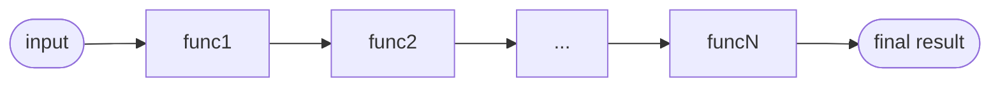

import { Info, Idea } from "@/components/Callout"

# Building Pipelines

Effect pipelines allow for the composition and sequencing of operations on values, enabling the transformation and manipulation of data in a concise and modular manner.

## Why Pipelines are Good for Structuring Your Application

Pipelines are an excellent way to structure your application and handle data transformations in a concise and modular manner. They offer several benefits:

1. **Readability**: Pipelines allow you to compose functions in a readable and sequential manner. You can clearly see the flow of data and the operations applied to it, making it easier to understand and maintain the code.

2. **Code Organization**: With pipelines, you can break down complex operations into smaller, manageable functions. Each function performs a specific task, making your code more modular and easier to reason about.

3. **Reusability**: Pipelines promote the reuse of functions. By breaking down operations into smaller functions, you can reuse them in different pipelines or contexts, improving code reuse and reducing duplication.

4. **Type Safety**: By leveraging the type system, pipelines help catch errors at compile-time. Functions in a pipeline have well-defined input and output types, ensuring that the data flows correctly through the pipeline and minimizing runtime errors.

Now, let's delve into how to define pipelines and explore some of the key components:

## pipe

The `pipe` function is a utility that allows us to compose functions in a readable and sequential manner. It takes the output of one function and passes it as the input to the next function in the pipeline. This enables us to build complex transformations by chaining multiple functions together.

The basic syntax of `pipe` is as follows:

```ts
import { pipe } from "effect"

const result = pipe(input, func1, func2, ..., funcN)
```

In this syntax, `input` is the initial value, and `func1`, `func2`, ..., `funcN` are the functions to be applied in sequence. The result of each function becomes the input for the next function, and the final result is returned.

Here's an illustration of how `pipe` works:



It's important to note that functions passed to `pipe` must have a **single argument** because they are only called with a single argument.

Let's see an example to better understand how `pipe` works:

```ts file=<rootDir>/src/essentials/pipeline/pipe.ts

```

In the above example, we start with an input value of `5`. The `increment` function adds `1` to the initial value, resulting in `6`. Then, the `double` function doubles the value, giving us `12`. Finally, the `subtractTen` function subtracts `10` from `12`, resulting in the final output of `2`.

## Functions vs Methods

In the Effect ecosystem, libraries often expose functions rather than methods. This design choice is important for two key reasons: tree shakeability and extendibility.

### Tree Shakeability

Tree shakeability refers to the ability of a build system to eliminate unused code during the bundling process. Functions are tree shakeable, while methods are not.

When functions are used in the Effect ecosystem, only the functions that are actually imported and used in your application will be included in the final bundled code. Unused functions are automatically removed, resulting in a smaller bundle size and improved performance.

On the other hand, methods are attached to objects or prototypes, and they cannot be easily tree shaken. Even if you only use a subset of methods, all methods associated with an object or prototype will be included in the bundle, leading to unnecessary code bloat.

### Extendibility

Another important advantage of using functions in the Effect ecosystem is the ease of extendibility. With methods, extending the functionality of an existing API often requires modifying the prototype of the object, which can be complex and error-prone.

In contrast, with functions, extending the functionality is much simpler. You can define your own "extension methods" as plain old functions without the need to modify the prototypes of objects. This promotes cleaner and more modular code, and it also allows for better compatibility with other libraries and modules.

<Idea>
  The use of functions in the Effect ecosystem libraries is important for
  achieving **tree shakeability** and ensuring **extendibility**. Functions
  enable efficient bundling by eliminating unused code, and they provide a
  flexible and modular approach to extending the libraries' functionality.
</Idea>

Now let's explore some examples of APIs that can be used with the `pipe` function to build pipelines.

## map

The `Effect.map` function is used to transform the value inside an `Effect`.
It takes a function and applies it to the value contained within the `Effect`, creating a **new** `Effect` with the transformed value.

<Info>
  It's important to note that `Effect`s are immutable, meaning that when you use
  `map` on an `Effect`, it doesn't modify the original data type. Instead, it
  returns a new copy of the `Effect` with the transformed value.
</Info>

The syntax for `map` is as follows:

```ts
import { pipe, Effect } from "effect"

const mappedEffect = pipe(effect, Effect.map(func))
```

In the code above, `func` represents the transformation function to be applied, and `effect` is the input `Effect`.

Let's see an example to better understand how `map` works:

```ts file=<rootDir>/src/essentials/pipeline/map.ts

```

In the example above:

- We define a simple `increment` function that adds `1` to its input.
- We create an `Effect` using `Effect.succeed` with an initial value of `5`.
- We use `map` to apply the `increment` function to the value inside the `effect`.

The resulting `Effect` contains the transformed value of `6`.

If you simply want to replace the value with a constant, you can use `Effect.as`:

```ts file=<rootDir>/src/essentials/pipeline/as.ts

```

## flatMap

In the previous example, we saw how to transform an `Effect` using the `map` function when the transformation function returns a regular value. But what if we want to transform an `Effect` using a function that itself returns another `Effect`?

The `Effect.flatMap` function allows us to chain computations that produce `Effect` values. It takes a transformation function that produces a new `Effect` and then "flattens" the nested `Effect` structure.

<Info>
  It's important to note that `Effect`s are immutable, meaning that when you use
  `flatMap` on an `Effect`, it doesn't modify the original data type. Instead,
  it returns a new copy of the `Effect` with the transformed value.
</Info>

The syntax for `flatMap` is as follows:

```ts
import { pipe, Effect } from "effect"

const flatMappedEffect = pipe(effect, Effect.flatMap(func))
```

In the code above, `func` represents the transformation function that returns a new `Effect`, and `effect` is the input `Effect` that we want to transform.

Let's see an example to better understand how `flatMap` works:

```ts file=<rootDir>/src/essentials/pipeline/flatMap.ts

```

In the example above:

- We define a function called `divide` that takes two numbers `a` and `b` and returns an `Effect` that can potentially succeed with the result of the division or fail with an error if `b` is zero.
- We create an `Effect` using `Effect.succeed` with a tuple containing the values `10` and `2`.
- We use `flatMap` to apply the `divide` function to the values inside the `effect`.

The resulting `Effect` contains the transformed value of `5`.

When using `Effect.flatMap`, it is crucial to ensure that **all effects** are properly considered in the computation. If you ignore an effect returned by a computation within `flatMap`, it can result in unexpected behavior and incorrect program logic.

Let's take a look at the following code snippet:

```ts {2}
Effect.flatMap(([a, b]) => {
  Effect.sync(() => console.log(`Performing division: ${a} / ${b}`))
  return divide(a, b)
})
```

The problem here is that the effect returned by `Effect.sync` will be ignored and not included in the resulting computation. It will not be chained or combined with the effect returned by`divide(a, b)`. As a result, you may encounter unexpected program behavior and obtain incorrect results.

To ensure correct behavior, make sure that any effect you want to include in the computation is explicitly chained using `flatMap` or combined with other `Effect` values using the appropriate functions provided by the Effect library.

In the next section, we will explore how to address this problem using the `tap` API.

## tap

In the previous section, we discussed the problem of ignoring effects in a computation.
To address this issue, we can use the `tap` API, which allows us to execute side effects without affecting the computation flow.

The `tap` API has a similar signature to `flatMap`, but the result of the transformation function is **ignored**.
This means that the value returned by the previous computation (i.e. `[a, b]`) will still be available for the next computation (i.e. `divide`).

Let's take a look at an updated code snippet that incorporates the `tap` API to fix the problem:

```ts {3-5} file=<rootDir>/src/essentials/pipeline/tap.ts#L8-

```

By using `Effect.tap`, we include the effect of `Effect.sync` in the computation. This ensures that the logging action is performed, providing us with the desired output and maintaining correct program logic. The resulting output is still `5`, as expected.

Using `tap` allows us to execute side effects during the computation without altering the result. This can be useful for logging, performing additional actions, or observing the intermediate values without interfering with the main computation flow.

## all

The `Effect.all` function is a powerful utility provided by Effect that allows you to combine multiple effects into a single effect that produces a tuple of results.

The syntax for `all` is as follows:

```ts
import { Effect } from "effect"

const combinedEffect = Effect.all(effects)
```

Here, `effects` represents multiple effects that you want to combine.

The `all` function will execute all these effects in **sequence** (to explore options for
managing concurrency and controlling how these effects are executed, you can
refer to the [Concurrency Options](../concurrency/concurrency-options)
documentation).

It will return a new effect that produces a tuple containing the results of each individual effect.
Keep in mind that the order of the results corresponds to the order of the original effects passed to `all`.

Let's see an example to better understand how `all` works:

```ts file=<rootDir>/src/essentials/pipeline/all.ts

```

In this example, `foo` and `bar` are two separate effects. Using `Effect.all`, we combine them into a single effect `combinedEffect`. When we run `combinedEffect`, it produces a tuple `[42, "Hello"]` containing the results of both effects.

<Info>
  The `all` function not only combines tuples but also works seamlessly with
  iterables, structs, and records. To explore the full potential of `all` head
  over to the [Introduction to Effect's Control Flow
  Operators](../control-flow#all) documentation.
</Info>

## Build your first pipeline

Now, let's combine all four functions (`pipe`, `map`, `flatMap` and `all`) to build a pipeline that performs a series of transformations:

```ts file=<rootDir>/src/essentials/pipeline/pipeline.ts

```

## The pipe method

Effect provides a `pipe` method that works similarly to the `pipe` method found in [`rxjs`](https://rxjs.dev/api/index/function/pipe). This method allows you to chain multiple operations together, making your code more concise and readable.

Here's how the `pipe` **method** works:

```ts
const result = effect.pipe(func1, func2, ..., funcN)
```

This is equivalent to using the `pipe` **function** like this:

```ts
const result = pipe(effect, func1, func2, ..., funcN)
```

The `pipe` method is available on all effects and many other data types, eliminating the need to import the `pipe` function from the `Function` module and saving you some keystrokes.

Let's rewrite the previous example using the `pipe` method:

```ts /.pipe/ file=<rootDir>/src/essentials/pipeline/pipe-method.ts

```

## Cheatsheet

Let's summarize the transformation functions we have seen so far:

| **Function** | **Input**                                 | **Output**                  |
| ------------ | ----------------------------------------- | --------------------------- |
| `map`        | `Effect<R, E, A>`, `A => B`               | `Effect<R, E, B>`           |
| `flatMap`    | `Effect<R, E, A>`, `A => Effect<R, E, B>` | `Effect<R, E, B>`           |
| `tap`        | `Effect<R, E, A>`, `A => Effect<R, E, B>` | `Effect<R, E, A>`           |
| `all`        | `Effect<R, E, A>`, `Effect<R, E, B>`, ... | `Effect<R, E, [A, B, ...]>` |

These functions are powerful tools for transforming and chaining `Effect` computations. They allow you to apply functions to values inside `Effect` and build complex pipelines of computations.

Remember to choose the appropriate function based on the type of transformation you want to perform. If you have a function that directly returns a value without wrapping it in an `Effect`, you can use `map`. If you have a function that returns an `Effect` itself, you can use `flatMap` to chain computations.
