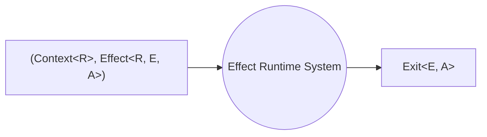

# Runtime

A `Runtime<R>` is a system that can execute effects, in order to execute any effect we need a `Runtime` that contains at least the reqirements of the effect we want to execute.

A `Runtime<R>` is a plain object that contains 3 things:

- a value of type `Context<R>`
- a value of type `FiberRefs`
- a value of type `RuntimeFlags`

## The Default Runtime

When using functions such as `Effect.run*` we are implicitly using the default runtime, it contains:

- an empty `Context<never>`
- a set of `FiberRefs` that include the default services
- a default config for `RuntimeFlags` that enables `Interruption` and `CooperativeYielding`

Using the default runtime is ok in most of the cases, it can be useful to create a custom runtime in order to reuse a specific context or configuration. It is very common to create a `Runtime<R>` as the result of initializing a `Layer<RIn, Err, R>` in order to reuse the context across execution boundaries (for example in a React App or to execute operations in a server when responding to api requests).

## What is a Runtime System?

When we write an Effect program, we construct an `Effect` using constructors and combinators. Essentially, we are creating a blueprint of a program. An `Effect` is merely a data structure that describes the execution of a concurrent program. It represents a tree-like structure that combines various primitives to define what the `Effect` should do.

However, this data structure itself does not perform any actions; it is solely a description of a concurrent program.

Therefore, it is crucial to understand that when working with a functional effect system like Effect, our code for actions such as printing to the console, reading files, or querying databases is actually building a workflow or blueprint for an application. We are constructing a data structure.

So how does Effect actually run these workflows? This is where the Effect Runtime System comes into play. When we invoke a `Runtime.run*` function, the Runtime System takes over, first it creates an empty root Fiber with:

- the initial context
- the initial fiberRefs
- the initial Effect

after creation of the Fiber it invokes the Fiber's runLoop that follows the instructions described by the `Effect`, executing them step by step.

To simplify, we can envision the Runtime System as a black box that takes both the effect ([`Effect<R, E, A>`](../concepts/effect-data-type)) and its associated context (`Context<R>`). It runs the effect and returns the result as an [`Exit<E, A>`](exit) value.

## Responsibilities of the Runtime System

Runtime Systems have a lot of responsibilities:

1. **Execute every step of the blueprint**. They have to execute every step of the blueprint in a while loop until it's done.

2. **Handle unexpected errors**. They have to handle unexpected errors, not just the expected ones but also the unexpected ones.

3. **Spawn concurrent fiber**. They are actually responsible for the concurrency that effect systems have. They have to spawn a fiber every time we call `fork` on an effect to spawn off a new fiber.

4. **Cooperatively yield to other fibers**. They have to cooperatively yield to other fibers so that fibers that are sort of hogging the spotlight, don't get to monopolize all the CPU resources.

5. **Ensure finalizers are run appropriately**. They have to ensure finalizers are run appropriately at the right point in all circumstances to make sure that resources are closed that clean-up logic is executed. This is the feature that powers [`Scope`](../tutorial/resource-management/scope) and all the other resource-safe constructs in Effect.

6. **Handle asynchronous callback**. They have to handle this messy job of dealing with asynchronous callbacks. So we don't have to deal with async code. When we are using Effect, everything can be interpreted as async or sync out of the box.
