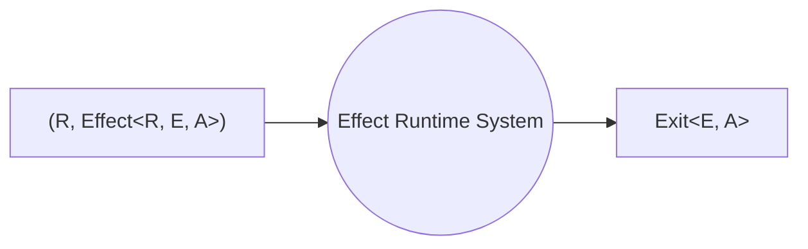

# Runtime

A `Runtime<R>` is a system that can execute tasks within a specific environment `R`.

To execute an effect, we need a `Runtime` that can handle the execution of effects. Runtimes consist of a thread pool and an associated environment required by the effects.

## What is a Runtime System?

When we write an Effect program, we construct an `Effect` using constructors and combinators. Essentially, we are creating a blueprint. An `Effect` is merely a data structure that describes the execution of a concurrent program. It represents a tree-like structure that combines various data structures to define what the `Effect` should do. However, this data structure itself does not perform any actions; it is solely a description of a concurrent program.

Therefore, it is crucial to understand that when working with a functional effect system like Effect, our code for actions such as printing to the console, reading files, or querying databases is actually building a workflow or blueprint for an application. We are constructing a data structure.

So how does Effect actually run these workflows? This is where the Effect Runtime System comes into play. When we invoke a `Runtime.run*` function, the Runtime System takes over and follows the instructions described by the `Effect`, executing them step by step.

To simplify, we can envision the Runtime System as a black box that takes both the effect ([`Effect<R, E, A>`](../concepts/effect-data-type)) and its associated environment (`R`). It runs the effect and returns the result as an [`Exit<E, A>`](exit) value.

## Responsibilities of the Runtime System

Runtime Systems have a lot of responsibilities:

1. **Execute every step of the blueprint**. They have to execute every step of the blueprint in a while loop until it's done.

2. **Handle unexpected errors**. They have to handle unexpected errors, not just the expected ones but also the unexpected ones.

3. **Spawn concurrent fiber**. They are actually responsible for the concurrency that effect systems have. They have to spawn a fiber every time we call `fork` on an effect to spawn off a new fiber.

4. **Cooperatively yield to other fibers**. They have to cooperatively yield to other fibers so that fibers that are sort of hogging the spotlight, don't get to monopolize all the CPU resources. They have to make sure that the fibers split the CPU cores among all the fibers that are working.

5. **Capture execution and stack traces**. They have to keep track of where we are in the progress of our own user-land code so the nice detailed execution traces can be captured.

6. **Ensure finalizers are run appropriately**. They have to ensure finalizers are run appropriately at the right point in all circumstances to make sure that resources are closed that clean-up logic is executed. This is the feature that powers [`Scope`](../tutorial/resource-management/scope) and all the other resource-safe constructs in Effect.

7. **Handle asynchronous callback**. They have to handle this messy job of dealing with asynchronous callbacks. So we don't have to deal with async code. When we are doing Effect, everything is just async out of the box.
