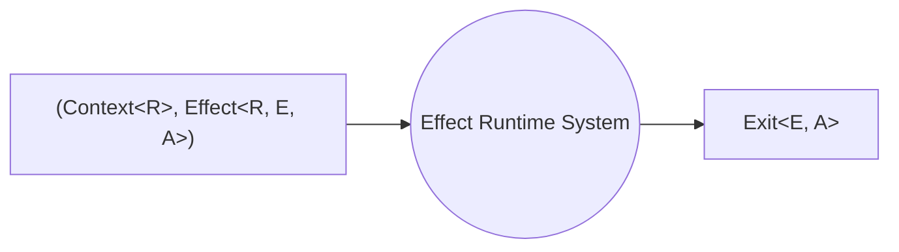

# Introduction to Runtime

The `Runtime<R>` data type represents a Runtime System that can execute effects. To execute any effect, we need a `Runtime` that includes the necessary requirements for that effect.

A `Runtime<R>` consists of three main components:

- a value of type `Context<R>`
- a value of type `FiberRefs`
- a value of type `RuntimeFlags`

## The Default Runtime

When we use functions like `Effect.run*`, we are actually using the **default runtime** without explicitly mentioning it. These functions are designed as convenient shortcuts for executing our effects using the default runtime.

For instance, in the `Runtime` module, there is a corresponding `Runtime.run*(defaultRuntime)` function that is called internally by `Effect.run*`, e.g. `Effect.runSync` is simply an alias for `Runtime.runSync(defaultRuntime)`.

The default runtime includes:

- An empty `Context<never>`
- A set of `FiberRefs` that include the default services
- A default configuration for `RuntimeFlags` that enables `Interruption` and `CooperativeYielding`

In most cases, using the default runtime is sufficient. However, it can be useful to create a custom runtime to reuse a specific context or configuration. It is common to create a `Runtime<R>` by initializing a `Layer<RIn, Err, R>`. This allows for context reuse across execution boundaries, such as in a React App or when executing operations on a server in response to API requests.

## What is a Runtime System?

When we write an Effect program, we construct an `Effect` using constructors and combinators. Essentially, we are creating a blueprint of a program. An `Effect` is merely a data structure that describes the execution of a concurrent program. It represents a tree-like structure that combines various primitives to define what the `Effect` should do.

However, this data structure itself does not perform any actions; it is solely a description of a concurrent program.

Therefore, it is crucial to understand that when working with a functional effect system like Effect, our code for actions such as printing to the console, reading files, or querying databases is actually building a workflow or blueprint for an application. We are constructing a data structure.

So how does Effect actually run these workflows? This is where the Effect Runtime System comes into play. When we invoke a `Runtime.run*` function, the Runtime System takes over. First, it creates an empty root Fiber with:

- The initial context
- The initial fiberRefs
- The initial Effect

After the creation of the Fiber, it invokes the Fiber's runLoop, which follows the instructions described by the `Effect` and executes them step by step.

To simplify, we can envision the Runtime System as a black box that takes both the effect ([`Effect<R, E, A>`](./essentials/effect-type)) and its associated context (`Context<R>`). It runs the effect and returns the result as an [`Exit<E, A>`](./data-types/exit) value.



## Responsibilities of the Runtime System

Runtime Systems have a lot of responsibilities:

1. **Execute every step of the blueprint**. They have to execute every step of the blueprint in a while loop until it's done.

2. **Handle unexpected errors**. They have to handle unexpected errors, not just the expected ones but also the unexpected ones.

3. **Spawn concurrent fiber**. They are actually responsible for the concurrency that effect systems have. They have to spawn a fiber every time we call `fork` on an effect to spawn off a new fiber.

4. **Cooperatively yield to other fibers**. They have to cooperatively yield to other fibers so that fibers that are sort of hogging the spotlight, don't get to monopolize all the CPU resources.

5. **Ensure finalizers are run appropriately**. They have to ensure finalizers are run appropriately at the right point in all circumstances to make sure that resources are closed that clean-up logic is executed. This is the feature that powers [`Scope`](./resource-management) and all the other resource-safe constructs in Effect.

6. **Handle asynchronous callback**. They have to handle this messy job of dealing with asynchronous callbacks. So we don't have to deal with async code. When we are using Effect, everything can be interpreted as async or sync out of the box.

## Default Runtime

Effect provides a default runtime named `Runtime.defaultRuntime` designed for mainstream usage.

The default runtime provides the minimum capabilities to bootstrap execution of Effect tasks.

Both of the following executions are equivalent:

```ts file=<rootDir>/src/guide/runtime/defaultRuntime.ts

```

Under the hood, `Effect.runSync` (and the same principle applies to other `Effect.run*` functions) serves as a convenient shorthand for `Runtime.runSync(Runtime.defaultRuntime)`.

## Locally Scoped Runtime Configuration

In Effect, runtime configurations are typically inherited from their parent workflows. This means that when we access a runtime configuration or obtain a runtime inside a workflow, we are essentially using the configuration of the parent workflow. However, there are cases where we want to temporarily override the runtime configuration for a specific part of our code. This concept is known as locally scoped runtime configuration. Once the execution of that code region is completed, the runtime configuration reverts to its original settings.

To achieve this, we make use of `Effect.provide*` functions, which allow us to provide a new runtime configuration to a specific section of our code.

### Configuring Runtime by Providing Configuration Layers

By utilizing the `Effect.provideLayer` function and providing runtime configuration layers to an Effect workflow, we can easily modify runtime configurations.

Here's an example:

```ts file=<rootDir>/src/guide/runtime/addSimpleLogger.ts

```

In this example, we first create a configuration layer for a simple logger using `Logger.replace`.
Then, we use `Effect.provideLayer` to provide this configuration to our program, effectively overriding the default logger with the simple logger.

To ensure that the runtime configuration is only applied to a specific part of an Effect application, we should provide the configuration layer exclusively to that particular section, as demonstrated in the following example:

```ts file=<rootDir>/src/guide/runtime/addSimpleLogger-region.ts

```

## Top-level Runtime Configuration

When developing an Effect application and executing it using `Effect.run*` functions, the application is automatically run using the default runtime behind the scenes. While we can adjust and customize specific aspects of our Effect application by providing locally scoped configuration layers using `Effect.provideLayer` operations, there are scenarios where we need to customize the runtime configuration for the entire application from the top level.

In such situations, we can create a top-level runtime by converting a configuration layer into a runtime using the `Layer.toRuntime` operator:

```ts file=<rootDir>/src/guide/runtime/toRuntime.ts

```

In this example, we first create a custom configuration layer called `appLayer`, which includes modifications to the logger configuration. Next, we transform this configuration layer into a runtime using `Layer.toRuntime`. This results in a top-level runtime that encapsulates the desired configuration for the entire Effect application.

We then define a custom runtime function named `myrunSync` using `Runtime.runSync(runtime)`. Finally, we create our Effect program and execute it using the custom runtime, which applies the top-level configuration.

By customizing the top-level runtime configuration, we can tailor the behavior of our entire Effect application to meet our specific needs and requirements.
