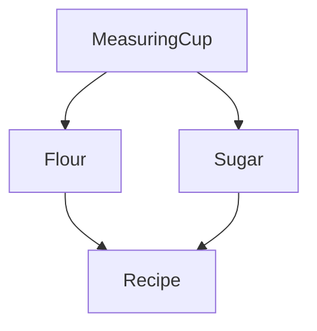

import { Idea, Info } from "@/components/Callout"
import { Tabs, Tab } from "@/components/Code"

# Managing Service Dependencies

In the [previous section](services), you learned how to create effects which depend on some context to be provided in order to execute, as well as how to provide that context to an Effect.

However, what if we have a service within the context of our Effect program which has a dependency on other services? To represent the "dependency graph" of our program we need a more powerful abstraction.

In this tutorial, we will cover the following topics:

- Using `Layer`s to control the construction of dependencies.
- Building a dependency graph with `Layer`s.
- Providing a `Layer` to an effect.

## Designing the Dependency Graph

Let's imagine that we want to bake a cake! We could imagine that the dependency graph for an application where we are creating a recipe for a cake might look something like:



From the dependency graph above, we can observe the following:

- Both the `Flour` and `Sugar` services depend on the `MeasuringCup` service.
- The `Recipe` service depends on its ingredients, which in this case are `Flour` and `Sugar`.

Our goal is to build the `Recipe` service along with its direct and indirect dependencies. This means we need to ensure that the `MeasuringCup` service is available for both `Flour` and `Sugar`, and then provide the ingredients to the `Recipe` service.

Now let's take our dependency graph and translate it into code.

## Creating Layers

We will use `Layers`s to construct the `Recipe` service instead of providing a service implementation directly as we did in the [Managing Services](services) tutorial.

A `Layer<RIn, E, ROut>` represents a blueprint for constructing a `Context<ROut>`. It takes a value of type `RIn` as input and may potentially produce an error of type `E` during the construction process.

In our case, the `ROut` type represents the service we want to construct. The `RIn` type represents all the dependencies required to construct the service.

<Info>
  For simplicity, let's assume that we won't encounter any errors during the
  value construction (meaning `E = never`).
</Info>

Now, let's determine how many layers we need to implement our dependency graph:

| **Layer**          | **Dependencies**                                                  | **Type**                               |
| ------------------ | ----------------------------------------------------------------- | -------------------------------------- |
| `MeasuringCupLive` | The `MeasuringCup` service does not depend on any other services  | `Layer<never, never, MeasuringCup>`    |
| `SugarLive`        | The `Sugar` service depends on the `MeasuringCup` service         | `Layer<MeasuringCup, never, Sugar>`    |
| `FlourLive`        | The `Flour` service depends on the `MeasuringCup` service         | `Layer<MeasuringCup, never, Flour>`    |
| `RecipeLive`       | The `Recipe` service depends on both `Flour` and `Sugar` services | `Layer<Flour \| Sugar, never, Recipe>` |

<Idea>
  A common convention when naming the `Layer` for a particular service is to add
  a `Live` suffix for the "live" implementation and a `Test` suffix for the
  "test" implementation. For example, for a `Database` service, the
  `DatabaseLive` would be the layer you provide in your application and the
  `DatabaseTest` would be the layer you provide in your tests.
</Idea>

When a service has multiple dependencies, they are represented as a **union type**. In our case, the `Recipe` service depends on both the `Flour` and `Sugar` services.
Therefore, the type for the `RecipeLive` layer will be:

```ts /Flour | Sugar/
Layer<Flour | Sugar, never, Recipe>
```

### MeasuringCup

The `MeasuringCup` service does not depend on any other services, so `MeasuringCupLive` will be the simplest layer to implement.
Just like in the [Managing Services](services) tutorial, we must create a `Tag` for the service.
And because the service has no dependencies, we can create the layer directly using `Layer.succeed(tag, service){:ts}`:

```ts filename="MeasuringCup.ts"
import { Effect, Context, Layer } from "effect"

// Define the interface for the MeasuringCup service
export interface MeasuringCup {
  readonly measure: (
    amount: number,
    unit: string
  ) => Effect.Effect<never, never, string>
}

// Create a tag for the MeasuringCup service
export const MeasuringCup = Context.Tag<MeasuringCup>()

// Layer<never, never, MeasuringCup>
export const MeasuringCupLive = Layer.succeed(
  MeasuringCup,
  MeasuringCup.of({
    measure: (amount, unit) => Effect.succeed(`Measured ${amount} ${unit}(s)`),
  })
)
```

Looking at the type of `MeasuringCupLive` we can observe:

- `RIn` is `never`, indicating that the layer has no dependencies
- `E` is `never`, indicating that layer construction cannot fail
- `ROut` is `MeasuringCup`, indicating that constructing the layer will produce a `MeasuringCup` service

### Sugar & Flour

Now we can move on to the implementation of the `Sugar` and `Flour` services, both of which depend on the `MeasuringCup` service to measure the proper amount of the ingredient.

Just like we did in the [Services](services#using-the-service) tutorial, we can map over the `MeasuringCup` Tag to "extract" the service from the context and make use of it within our ingredient services.

Given that mapping over a Tag is an effectful operation, we use `Layer.effect(tag, effect){:ts}` to create a `Layer` from the resulting `Effect`.

```ts filename="Ingredients.ts"
import { Effect, Context, Layer } from "effect"
import { MeasuringCup } from "./MeasuringCup"

// Sugar

export interface Sugar {
  readonly grams: (amount: number) => Effect.Effect<never, never, string>
}

export const Sugar = Context.Tag<Sugar>()

// Layer<MeasuringCup, never, Sugar>
export const SugarLive = Layer.effect(
  Sugar,
  Effect.map(MeasuringCup, (measuringCup) =>
    Sugar.of({
      grams: (amount) => measuringCup.measure(amount, "gram"),
    })
  )
)

// Flour

export interface Flour {
  readonly cups: (amount: number) => Effect.Effect<never, never, string>
}

export const Flour = Context.Tag<Flour>()

// Layer<MeasuringCup, never, Flour>
export const FlourLive = Layer.effect(
  Flour,
  Effect.map(MeasuringCup, (measuringCup) =>
    Flour.of({
      cups: (amount) => measuringCup.measure(amount, "cup"),
    })
  )
)
```

Looking at the type of `SugarLive` and `FlourLive` we can observe:

- `RIn` is `MeasuringCup`, indicating that the layer has a dependency
- `E` is `never`, indicating that layer construction cannot fail
- `ROut` is our ingredient

### Recipe

Finally, we can use our ingredients to assemble the final recipe:

<Tabs>
<Tab>

```ts filename="Recipe.ts"
import { Effect, Context, Layer } from "effect"
import { Flour, Sugar } from "./Ingredients"

export interface Recipe {
  readonly steps: Effect.Effect<never, never, ReadonlyArray<string>>
}

export const Recipe = Context.Tag<Recipe>()

// Layer<Flour | Sugar, never, Recipe>
export const RecipeLive = Layer.effect(
  Recipe,
  Effect.map(Effect.all([Sugar, Flour]), ([sugar, flour]) =>
    Recipe.of({
      steps: Effect.all([sugar.grams(200), flour.cups(1)]),
    })
  )
)
```

</Tab>
<Tab>

```ts filename="Recipe.ts"
import { Effect, Context, Layer } from "effect"
import { Flour, Sugar } from "./Ingredients"

export interface Recipe {
  readonly steps: Effect.Effect<never, never, ReadonlyArray<string>>
}

export const Recipe = Context.Tag<Recipe>()

// Layer<Flour | Sugar, never, Recipe>
export const RecipeLive = Layer.effect(
  Recipe,
  Effect.gen(function* (_) {
    const sugar = yield* _(Sugar)
    const flour = yield* _(Flour)
    return Recipe.of({
      steps: Effect.all([sugar.grams(200), flour.cups(1)]),
    })
  })
)
```

</Tab>
</Tabs>

Looking at the type of `RecipeLive` we can observe that the `RIn` type is `Flour | Sugar`, i.e. the `Recipe` service requires both `Flour` and `Sugar` services.

## Combining Layers

Layers can be combined in two primary ways: merging and composing.

### Merging

Layers can be combined through merging using the `Layer.merge` combinator:

```ts
Layer.merge(layer1, layer2)
```

When we merge two layers, the resulting layer:

- requires all the services that both of them require.
- produces all services that both of them produce.

Merging is useful when we combine layers that don't have any relationship with each other.

For example, in our cake recipe application above, we can merge our `FlourLive` and `SugarLive` layers
into a single `IngredientsLive` layer, which retains the requirements of both layers (`MeasuringCup`) and the outputs of both layers (`Flour | Sugar`):

```ts filename="main.ts"
import { Layer } from "effect"
import { FlourLive, SugarLive } from "./Ingredients"

// Layer<MeasuringCup, never, Flour | Sugar>
const IngredientsLive = Layer.merge(FlourLive, SugarLive)
```

### Composing

Layers can be composed using the `Layer.provide` combinator:

```ts
pipe(layer1, Layer.provide(layer2))
```

Sequential composition of layers implies that the output of one layer is used as input for the subsequent layer,
resulting in one layer with the requirement of the first, and the output of the second.

Now we can compose the `MeasuringCupLive` layer with the `IngredientsLive` layer, and then compose the result with the `RecipeLive` layer:

```ts filename="main.ts"
import { Layer } from "effect"
import { FlourLive, SugarLive } from "./Ingredients"
import { MeasuringCupLive } from "./MeasuringCup"
import { RecipeLive } from "./Recipe"

// Layer<MeasuringCup, never, Flour | Sugar>
const IngredientsLive = Layer.merge(FlourLive, SugarLive)

// Layer<never, never, Recipe>
const MainLive = MeasuringCupLive.pipe(
  Layer.provide(IngredientsLive), // provides the MeasuringCup to the ingredients
  Layer.provide(RecipeLive) // provides the ingredients to the recipe
)
```

## Providing a Layer to an Effect

Now that we have assembled the fully resolved `MainLayer` for our application,
we can provide it to our program to satisfy the program's requirements using `Effect.provideLayer(effect, layer){:ts}`:

<Tabs>
<Tab>

```ts filename="main.ts" {27}
import { Effect, Layer } from "effect"
import { FlourLive, SugarLive } from "./Ingredients"
import { MeasuringCupLive } from "./MeasuringCup"
import { Recipe, RecipeLive } from "./Recipe"

// Layer<MeasuringCup, never, Flour | Sugar>
const IngredientsLive = Layer.merge(FlourLive, SugarLive)

// Layer<never, never, Recipe>
const MainLive = MeasuringCupLive.pipe(
  Layer.provide(IngredientsLive),
  Layer.provide(RecipeLive)
)

// Effect<Recipe, never, void>
const program = Recipe.pipe(
  Effect.flatMap((recipe) => recipe.steps),
  Effect.flatMap((steps) =>
    Effect.forEach(steps, (step) => Effect.log(step), {
      concurrency: "unbounded",
      discard: true,
    })
  )
)

// Effect<never, never, void>
const runnable = Effect.provideLayer(program, MainLive)

Effect.runPromise(runnable)

// ...more output... message="Measured 200 gram(s)"
// ...more output... message="Measured 1 cup(s)"
```

The `Effect.forEach` function is used to iterate over a collection of values (`steps`) and perform a side effect on each element (`Effect.logInfo`), discarding the result (`void`).

</Tab>
<Tab>

```ts filename="main.ts" {25}
import { Effect, Layer } from "effect"
import { FlourLive, SugarLive } from "./Ingredients"
import { MeasuringCupLive } from "./MeasuringCup"
import { Recipe, RecipeLive } from "./Recipe"

// Layer<MeasuringCup, never, Flour | Sugar>
const IngredientsLive = Layer.merge(FlourLive, SugarLive)

// Layer<never, never, Recipe>
const MainLive = MeasuringCupLive.pipe(
  Layer.provide(IngredientsLive),
  Layer.provide(RecipeLive)
)

// Effect<Recipe, never, void>
const program = Effect.gen(function* (_) {
  const recipe = yield* _(Recipe)
  const steps = yield* _(recipe.steps)
  for (const step of steps) {
    yield* _(Effect.log(step))
  }
})

// Effect<never, never, void>
const runnable = Effect.provideLayer(program, MainLive)

Effect.runPromise(runnable)

// ...more output... message="Measured 200 gram(s)"
// ...more output... message="Measured 1 cup(s)"
```

</Tab>
</Tabs>
