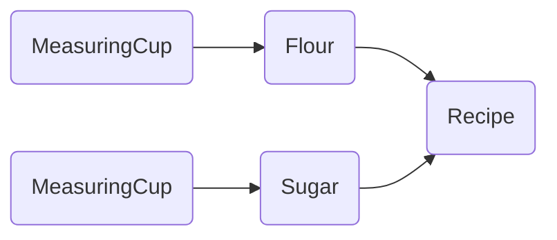

import { Idea } from "@/components/Callout"

# Building a Dependency Graph

In the previous section, you learned how to create effects which depend on some context to be provided in order to execute, as well as how to provide that context to an Effect.

However, what if we have a service within the context of our Effect program which has a dependency on other services? To represent the dependency graph of our program we need a more powerful abstraction.

In this tutorial you will learn:

- How to use `Layer`s to control how dependencies are constructed
- How to use `Layer`s to build a dependency graph
- How to use `Layer`s to provide alternate implementations of a service

## Designing the Dependency Graph

Let's imagine that we want to bake a cake! We could imagine that the dependency graph for an application where we are creating a recipe for a cake might look something like:



From the dependency graph above, we can observe the following:
- Our `Recipe` has a dependency on it's ingredients, in this example the `Flour` and `Sugar`
- Both the `Flour` and the `Sugar` have a dependency on the `MeasuringCup`

## Creating Service Constructors

Now let's take our dependency graph and translate it into code.

In this tutorial we will use `Layer`s to construct our services instead of providing service implementations directly (as we did in the [Services](services) tutorial).

A `Layer<RIn, E, ROut>{:ts}` is a recipe for building an environment of type `ROut`, starting from a value `RIn`, and possibly producing an error `E` during construction.

### MeasuringCup

Our `MeasuringCup` service does not depend on any other services, so it will be the simplest to implement. Just like in the [Services](services) tutorial, we must create a `Tag` for the layer. And because the layer has no dependencies, we can create it directly using `Layer.succeed`:

```ts filename="MeasuringCup.ts" /Layer.Layer<never, never, MeasuringCup>/
import * as Context from "@effect/data/Context"
import * as Effect from "@effect/io/Effect"
import * as Layer from "@effect/io/Layer"

export interface MeasuringCup {
  readonly measure: (amount: number, unit: string) => Effect.Effect<never, never, string>
}

export const MeasuringCup = Context.Tag<MeasuringCup>()

export const MeasuringCupLive: Layer.Layer<never, never, MeasuringCup> = Layer.succeed(
  MeasuringCup,
  MeasuringCup.of({
    measure: (amount, unit) => Effect.succeed(`Measured ${amount} ${unit}(s)`)
  })
)
```

<Idea>
  A common convention when naming the `Layer` for a particular service is to add a `Live` suffix for the "live" implementation and a `Test` suffix for the "test" implementation. For example, for a `Database` service, the `DatabaseLive` would be the layer you provide in your application and the `DatabaseTest` would be the layer you provide in your tests.
</Idea>

Looking at the type of our `MeasuringCupLive` layer above, we can see observe:

- `RIn` is `never`, indicating that the layer has no dependencies
- `E` is `never`, indicating that layer construction cannot fail
- `ROut` is `MeasuringCup`, indicating that constructing the layer will produce a `MeasuringCup` service

### Sugar & Flour

Now we can move on to the implementation of the `Sugar` and `Flour` services, both of which depend on the `MeasuringCup` service to measure the proper amount of the ingredient.

Just like we did in the [Services](services) tutorial, we can map over the `MeasuringCup` Tag to "extract" the service from the environment and make use of it within our ingredient services.

Given that mapping over a Tag is an effectful operation, we use `Layer.effect` to create a `Layer` from the resulting `Effect`.

```ts filename="Ingredients.ts" /Layer.Layer<MeasuringCup, never, Sugar>/ /Layer.Layer<MeasuringCup, never, Flour>/
import * as Context from "@effect/data/Context"
import * as Effect from "@effect/io/Effect"
import * as Layer from "@effect/io/Layer"

import { MeasuringCup } from "./MeasuringCup"

// Sugar

export interface Sugar {
  readonly grams: (amount: number) => Effect.Effect<never, never, string>
}

export const Sugar = Context.Tag<Sugar>()

export const SugarLive: Layer.Layer<MeasuringCup, never, Sugar> = Layer.effect(
  Sugar,
  Effect.map(MeasuringCup, (measuringCup) =>
    Sugar.of({
      grams: (amount) => measuringCup.measure(amount, "gram")
    }))
)

// Flour

export interface Flour {
  readonly cups: (amount: number) => Effect.Effect<never, never, string>
}

export const Flour = Context.Tag<Flour>()

export const FlourLive: Layer.Layer<MeasuringCup, never, Flour> = Layer.effect(
  Flour,
  Effect.map(MeasuringCup, (measuringCup) =>
    Flour.of({
      cups: (amount) => measuringCup.measure(amount, "cup")
    }))
)
```

Notice that the `Layer` type now indicates that the `MeasuringCup` is a dependency of our ingredient services (i.e. the `RIn` is `MeasuringCup` and the `ROut` is our ingredient).

### Recipe

Finally, we can use our ingredients to assemble the final recipe:

```ts filename="Recipe.ts" /Layer.Layer<Flour | Sugar, never, Recipe>/
import * as Context from "@effect/data/Context"
import * as Effect from "@effect/io/Effect"
import * as Layer from "@effect/io/Layer"

import { Flour, Sugar } from "./Ingredients"

export interface Recipe {
  readonly steps: Effect.Effect<never, never, ReadonlyArray<string>>
}

export const Recipe = Context.Tag<Recipe>()

export const RecipeLive: Layer.Layer<Flour | Sugar, never, Recipe> = Layer.effect(
  Recipe,
  Effect.gen(function*(_) {
    const sugar = yield* _(Sugar)
    const flour = yield* _(Flour)
    return Recipe.of({
      steps: Effect.all(sugar.grams(200), flour.cups(1))
    })
  })
)
```

Notice that the `Layer` type now indicates that the `Recipe` requires both `Flour` and `Sugar` services (i.e. the `RIn` is `Flour | Sugar{:ts}`).

## Horizontal Layer Composition

Layers can be composed together horizontally using the `Layer.merge*` combinators. When we compose layers horizontally, the new layer requires all the services that both of them require and produces all services that both of them produce. Horizontal composition is a way of composing two or more layers side-by-side. It is useful when we combine layers that don't have any relationship with each other.

For example, in our cake recipe application above, we can horizontally compose our `Flour` and `Sugar` layers into a single layer which retains the requirements of both layers and the capabilities of both layers:

```ts filename="main.ts"
import * as Layer from "@effect/io/Layer"

import type { MeasuringCup } from "./MeasuringCup"
import type { Flour, Sugar } from "./Ingredients"
import { FlourLive, SugarLive } from "./Ingredients"

const IngredientsLive: Layer.Layer<MeasuringCup, never, Flour | Sugar> =
  Layer.merge(FlourLive, SugarLive)
```

## Vertical Layer Composition

We can also compose layers vertically using the `Layer.provide` combinator. Vertical composition of layers implies that the output of one layer is used as input for the subsequent layer, resulting in one layer with the requirement of the first, and the output of the second.

For example, the `IngredientsLive` layer we constructed in the previous section requires a `MeasuringCup` and produces `Flour` and `Sugar`. Using vertical composition, we can compose the `IngredientsLive` layer with the `RecipeLive` layer which requires `Flour` and `Sugar` to produce a `Recipe`. The resulting `RecipeWithIngredientsLive` layer will require the `MeasuringCup` from the `IngredientsLive` layer and produces the `Recipe` from the `RecipeLive` layer.

```ts filename="main.ts"
import * as Layer from "@effect/io/Layer"

import type { MeasuringCup } from "./MeasuringCup"
import type { Flour, Sugar } from "./Ingredients"
import { FlourLive, SugarLive } from "./Ingredients"
import type { Recipe } from "./Recipe"
import { RecipeLive } from "./Recipe"

const IngredientsLive: Layer.Layer<MeasuringCup, never, Flour | Sugar> =
  Layer.merge(FlourLive, SugarLive)

const RecipeWithIngredientsLive: Layer.Layer<MeasuringCup, never, Recipe> =
  Layer.provide(IngredientsLive, RecipeLive)
```

We could also apply vertical composition multiple times to directly produce the `MainLayer` of our application:

```ts filename="main.ts"
import { pipe } from "@effect/data/Function"
import * as Layer from "@effect/io/Layer"

import type { MeasuringCup } from "./MeasuringCup"
import { MeasuringCupLive } from "./MeasuringCup"
import type { Flour, Sugar } from "./Ingredients"
import { FlourLive, SugarLive } from "./Ingredients"
import type { Recipe } from "./Recipe"
import { RecipeLive } from "./Recipe"

const IngredientsLive: Layer.Layer<MeasuringCup, never, Flour | Sugar> =
  Layer.merge(FlourLive, SugarLive)

const MainLayer: Layer.Layer<never, never, Recipe> = pipe(
  MeasuringCupLive,
  Layer.provide(IngredientsLive), // provides the MeasuringCup to the ingredients
  Layer.provide(RecipeLive) // provides the ingredients to the recipe
)
```

## Providing a Layer to an Effect

Now that we have assembled the fully resolved `MainLayer` for our application, we can provide it to our program to satisfy the program's requirements:

```ts filename="main.ts"
import { pipe } from "@effect/data/Function"
import * as Layer from "@effect/io/Layer"

import type { MeasuringCup } from "./MeasuringCup"
import { MeasuringCupLive } from "./MeasuringCup"
import type { Flour, Sugar } from "./Ingredients"
import { FlourLive, SugarLive } from "./Ingredients"
import type { Recipe } from "./Recipe"
import { RecipeLive } from "./Recipe"

const MainLayer: Layer.Layer<never, never, Recipe> = pipe(
  MeasuringCupLive,
  Layer.provide(Layer.merge(FlourLive, SugarLive)),
  Layer.provide(RecipeLive)
)

const program: Effect.Effect<Recipe, never, void> = pipe(
  Effect.flatMap(Recipe, (recipe) => recipe.steps),
  Effect.flatMap(Effect.forEach(Effect.log)),
  Effect.asUnit
)

pipe(
  program,
  Effect.provideLayer(MainLayer),
  Effect.runFork
)

// ...more output... message="Measured 200 gram(s)"
// ...more output... message="Measured 1 cup(s)"
```
